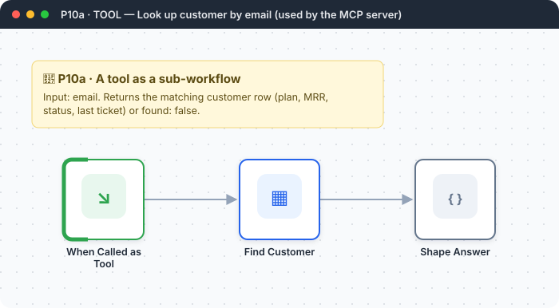
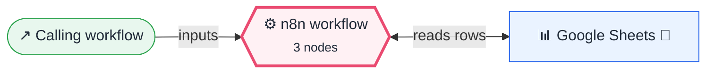

<div align="center">

# P10a · Tool sub-workflow: look up customer

    [](https://github.com/callme-siva/n8n-knowledge/actions/workflows/validate.yml)



</div>

> [!NOTE]
> **The real-world problem.** Helper used by [P10 · MCP server](../P10-mcp-server-business-tools/README.md). Any sub-workflow can become a tool for an AI agent or an MCP client.

## 🎯 What you'll learn

- Execute Workflow Trigger inputs as tool parameters
- `alwaysOutputData` for "not found" answers

## 🏗️ Architecture

**System context:** who and what this workflow talks to, and what crosses each boundary. 🔑 = needs a credential · 🧑 = a human decides.



<details><summary><b>Node-level flow</b> (every node and branch)</summary>


</details>

<details><summary>Plain-text flow</summary>

```
Execute Workflow Trigger (email) → Sheets lookup → Code (found / not found)
```

</details>

## 🔑 Credentials

| You need | Where to get it |
|---|---|
| Google Sheets OAuth2 (tab `Customers` | email, name, plan, mrr, status, last_ticket) |

## 📝 Before you run it

Replace these placeholder values with your own:

| Node | Field | Placeholder |
|---|---|---|
| Find Customer | `documentId` | `PASTE_YOUR_GOOGLE_SHEET_URL` |

Nodes that need a credential selected after import: **Google Sheets**.

### 📥 Starter files

Create each tab from its template, so column names match exactly: **Google Sheets → File → Import → Upload** the CSV → *Insert new sheet(s)*. The tab takes the file's name.

| Tab | Template | Columns |
|---|---|---|
| `Customers` | [Customers.csv](../../templates/P10a-tool-lookup-customer/Customers.csv) | `email`, `mrr`, `plan`, `status` |

<sub>Columns are generated from what this workflow actually reads and writes in the automated test, so they can't drift from the workflow.</sub>

## 🛠️ Build it step by step

> [!TIP]
> In a hurry? Import [`workflow.json`](workflow.json) (copy → paste on the n8n canvas). Learning? Build it yourself using the steps below, then compare.

1. Import and **save** this first. Copy its ID from the URL.
2. Paste the ID into P10's *lookup_customer* tool.

## 🔍 Node-by-node reference

Every node in this workflow and every setting inside it, generated from [`workflow.json`](workflow.json). Click a node to expand it.

<details><summary><b>1. When Called as Tool</b> · <code>Execute Workflow Trigger</code> v1.1</summary>

> Makes this workflow callable from other workflows, like a function.

| Property | Value |
|---|---|
| `workflowInputs.name` | email |

</details>

<details><summary><b>2. Find Customer</b> · <code>Google Sheets</code> v4.5</summary>

> Reads, appends or updates rows in a spreadsheet.

| Property | Value |
|---|---|
| `documentId` | PASTE_YOUR_GOOGLE_SHEET_URL |
| `sheetName` | Customers |
| `filtersUI.lookupColumn` | email |
| `filtersUI.lookupValue` | `{{ $json.email.toLowerCase() }}` |
| `⚙️ Retry on fail` | ✅ on |
| `⚙️ Max tries` | 3 |
| `⚙️ Wait between tries (ms)` | 3000 |
| `⚙️ Always output data` | ✅ on |

</details>

<details><summary><b>3. Shape Answer</b> · <code>Code</code> v2</summary>

> Runs JavaScript. *Run once for all items* sees every item; *for each item* sees one at a time.

| Property | Value |
|---|---|
| `jsCode` | (JavaScript, 2 lines, shown below) |

**Code:**

```javascript
const r = $input.first()?.json || {};
return [{ json: r.email ? { found: true, ...r } : { found: false, message: 'No customer with that email' } }];
```

</details>

> [!TIP]
> ⚙️ rows come from each node's **Settings** tab, not its Parameters tab. `{{ … }}` values are **expressions** evaluated at run time. See [workflow anatomy](../../docs/workflow-anatomy.md) for what every property means.

## ✅ Test it

> [!TIP]
> **Automated end-to-end test: passed.** 3/3 nodes executed in real n8n (2 credentialed or AI nodes replaced by fixtures, so AI output itself isn't tested), 1 behaviour checks. See [tests/](../../tests/README.md).

- [ ] Run P10 and ask an MCP client "what plan is asha@finlytics.example.com on?"

## 🧯 Troubleshooting

Problems specific to this workflow are below. For general ones (expressions, items, triggers, AI), see [common mistakes](../../docs/common-mistakes.md).

<details><summary><b>Always not found</b></summary>

The sheet email column must be lowercase, or lowercase it in a helper column.

</details>

## 🚀 Ideas to extend it

- Add `create_ticket` and `get_invoices` tools the same way.

---

<p align="center"><a href="../P10-mcp-server-business-tools/README.md">← Used by P10 · MCP server</a> &nbsp;·&nbsp; <a href="../../README.md#-the-learning-path">📚 All lessons</a></p>
