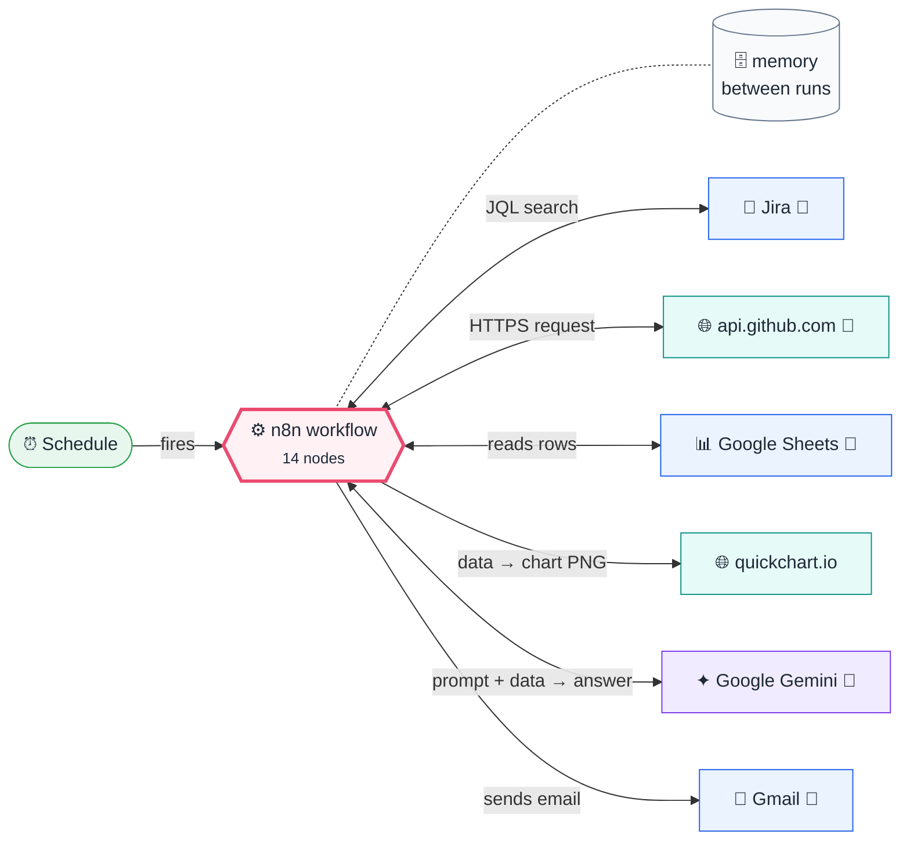
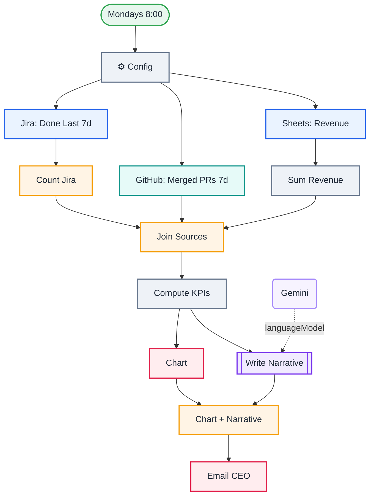

<div align="center">

# P12 · Weekly executive KPI report

    [](https://github.com/callme-siva/n8n-knowledge/actions/workflows/validate.yml)


</div>

> [!NOTE]
> **The real-world problem.** Every Monday someone in a company spends 2–3 hours pulling numbers from Jira, GitHub and finance sheets into a status email. This workflow does it in seconds: it **joins three systems in parallel**, computes week-over-week changes, draws a chart, and has an AI write the *so-what* in plain language, grounded strictly in the numbers.

## 💡 Concept first

**📌 Key idea:** **Numbers from code, narrative from AI**: join systems in parallel, compute deltas, then explain them.

**🧠 Mental model:** An analyst builds the table; a chief of staff writes the three bullets the CEO actually reads.

**🚫 When *not* to use it:** Don't let the model compute or "estimate" KPIs. It only narrates numbers it's given.

## 🎯 What you'll learn

- **Parallel fan-out** to three sources, joined with a 3-input **Merge (combine by position)**
- Aggregating counts in n8n vs in code
- GitHub **search API** for merged PRs (`total_count`)
- **Week-over-week deltas** using static data as last week's memory
- Keeping AI honest: numbers from code, narrative from the LLM
- Joining binary (chart) and text (narrative) branches before sending

## 🏗️ Architecture

**System context:** who and what this workflow talks to, and what crosses each boundary. 🔑 = needs a credential · 🧑 = a human decides.



<details><summary><b>Node-level flow</b> (every node and branch)</summary>



</details>

## ⚖️ Design decisions & trade-offs

Why it's built this way, and what it costs.

| Decision | Why | Trade-off / alternative |
|---|---|---|
| Fetch three sources **in parallel**, join with Merge | Faster, and each source can fail and retry independently | Every branch must return exactly one item |
| KPIs and deltas computed in code; AI only narrates | Numbers stay exact; the AI adds the so-what | The narrative is only as good as the metrics you choose |
| Last week's KPIs kept in static data | Week-over-week change with no extra database | Lost on re-import; store weekly KPIs in a sheet for long trends |
| Chart + narrative merged before the email | One email with everything, in a predictable order | A failed chart blocks the email. Add On Error → continue for non-critical parts |

## 🔑 Credentials

| You need | Where to get it |
|---|---|
| Jira Software Cloud API token | [docs/credentials.md](../../docs/credentials.md) |
| GitHub API token | [docs/credentials.md](../../docs/credentials.md) |
| Google Sheets OAuth2 (tab `Sales` from Q05) | [docs/credentials.md](../../docs/credentials.md) |
| Google Gemini API key | [docs/credentials.md](../../docs/credentials.md) |
| Gmail OAuth2 | [docs/credentials.md](../../docs/credentials.md) |

## 📝 Before you run it

Replace these placeholder values with your own:

| Node | Field | Placeholder |
|---|---|---|
| ⚙️ Config | `email_to` | `you@example.com` |
| Sheets: Revenue | `documentId` | `PASTE_YOUR_GOOGLE_SHEET_URL` |

Nodes that need a credential selected after import: **Gmail**, **Google Gemini Chat Model**, **Google Sheets**, **HTTP Request**, **Jira Software**.

### 📥 Starter files

Create each tab from its template, so column names match exactly: **Google Sheets → File → Import → Upload** the CSV → *Insert new sheet(s)*. The tab takes the file's name.

| Tab | Template | Columns |
|---|---|---|
| `Sales` | [Sales.csv](../../templates/P12-weekly-exec-kpi-report/Sales.csv) | `date`, `orders`, `revenue` |

<sub>Columns are generated from what this workflow actually reads and writes in the automated test, so they can't drift from the workflow.</sub>

## 🛠️ Build it step by step

> [!TIP]
> In a hurry? Import [`workflow.json`](workflow.json) (copy → paste on the n8n canvas). Learning? Build it yourself using the steps below, then compare.

1. Set the Jira project, GitHub repo and email in Config.
2. Reuse the `Sales` tab from Q05.
3. Run it once (the first run has no last week, so changes show –), then run again to see the deltas.

## 🔍 Node-by-node reference

Every node in this workflow and every setting inside it, generated from [`workflow.json`](workflow.json). Click a node to expand it.

<details><summary><b>1. Mondays 8:00</b> · <code>Schedule Trigger</code> v1.2</summary>

> Starts the workflow on a timer or cron expression. Only fires when the workflow is **active**.

| Property | Value |
|---|---|
| `rule.interval.field` | cronExpression |
| `rule.interval.expression` | 0 8 * * 1 |

</details>

<details><summary><b>2. ⚙️ Config</b> · <code>Edit Fields (Set)</code> v3.4</summary>

> Creates, renames or overwrites fields without code.

| Property | Value |
|---|---|
| `jira_project` | SCRUM |
| `github_repo` | n8n-io/n8n |
| `email_to` | you@example.com |

</details>

<details><summary><b>3. Jira: Done Last 7d</b> · <code>Jira Software</code> v1</summary>

> Creates, searches or updates Jira issues.

| Property | Value |
|---|---|
| `operation` | getAll |
| `returnAll` | ✅ on |
| `jql` | `project = {{ $('⚙️ Config').item.json.jira_project }} AND statusCategory = Done AND res…` |
| `fields` | key,issuetype,priority |
| `⚙️ Retry on fail` | ✅ on |
| `⚙️ Always output data` | ✅ on |

</details>

<details><summary><b>4. GitHub: Merged PRs 7d</b> · <code>HTTP Request</code> v4.2</summary>

> Calls any REST API. Use it whenever there's no dedicated node.

| Property | Value |
|---|---|
| `url` | https://api.github.com/search/issues |
| `authentication` | predefinedCredentialType |
| `nodeCredentialType` | githubApi |
| `sendQuery` | ✅ on |
| `queryParameters.q` | `repo:{{ $('⚙️ Config').item.json.github_repo }} is:pr is:merged merged:>={{ $now.minus(…` |
| `queryParameters.per_page` | 1 |
| `⚙️ Retry on fail` | ✅ on |

</details>

<details><summary><b>5. Sheets: Revenue</b> · <code>Google Sheets</code> v4.5</summary>

> Reads, appends or updates rows in a spreadsheet.

| Property | Value |
|---|---|
| `documentId` | PASTE_YOUR_GOOGLE_SHEET_URL |
| `sheetName` | Sales |
| `⚙️ Retry on fail` | ✅ on |
| `⚙️ Max tries` | 3 |
| `⚙️ Wait between tries (ms)` | 3000 |
| `⚙️ Always output data` | ✅ on |

</details>

<details><summary><b>6. Count Jira</b> · <code>aggregate</code> v1</summary>


| Property | Value |
|---|---|
| `aggregate` | aggregateAllItemData |
| `destinationFieldName` | issues |

</details>

<details><summary><b>7. Sum Revenue</b> · <code>Code</code> v2</summary>

> Runs JavaScript. *Run once for all items* sees every item; *for each item* sees one at a time.

| Property | Value |
|---|---|
| `jsCode` | (JavaScript, 4 lines, shown below) |

**Code:**

```javascript
const since = Date.now() - 7 * 86400000, prevSince = since - 7 * 86400000;
let rev = 0, prev = 0, orders = 0;
for (const { json: r } of $input.all()) { const t = Date.parse(r.date); if (t >= since) { rev += +r.revenue || 0; orders += +r.orders || 0; } else if (t >= prevSince) prev += +r.revenue || 0; }
return [{ json: { revenue: Math.round(rev), revenue_prev: Math.round(prev), orders } }];
```

</details>

<details><summary><b>8. Join Sources</b> · <code>Merge</code> v3</summary>

> Waits for several inputs and combines them into one stream.

| Property | Value |
|---|---|
| `numberInputs` | 3 |
| `mode` | combine |
| `combineBy` | combineByPosition |

</details>

<details><summary><b>9. Compute KPIs</b> · <code>Code</code> v2</summary>

> Runs JavaScript. *Run once for all items* sees every item; *for each item* sees one at a time.

| Property | Value |
|---|---|
| `jsCode` | (JavaScript, 10 lines, shown below) |

**Code:**

```javascript
const j = $input.first().json;
const state = $getWorkflowStaticData('global');
const issues = (j.issues || []).filter(i => i.key);
const k = { stories_done: issues.length, bugs_fixed: issues.filter(i => (i.fields?.issuetype?.name || '').toLowerCase() === 'bug').length,
  prs_merged: j.total_count ?? 0, revenue: j.revenue ?? 0, orders: j.orders ?? 0 };
const prev = state.last || {};
const delta = key => prev[key] ? Math.round((k[key] - prev[key]) / prev[key] * 100) : null;
const rows = Object.keys(k).map(key => ({ key, value: k[key], prev: prev[key] ?? '–', change: delta(key) }));
state.last = k;
return [{ json: { kpis: k, rows, labels: Object.keys(k), values: Object.values(k), revenue_prev: j.revenue_prev } }];
```

</details>

<details><summary><b>10. Chart</b> · <code>quickChart</code> v1</summary>


| Property | Value |
|---|---|
| `chartType` | bar |
| `labelsMode` | array |
| `labelsArray` | `{{ $json.labels.slice(0, 3) }}` |
| `data` | `{{ $json.values.slice(0, 3) }}` |
| `output` | chart |
| `chartOptions.width` | 600 |
| `chartOptions.height` | 280 |
| `chartOptions.backgroundColor` | #ffffff |
| `datasetOptions.label` | Delivery this week |
| `datasetOptions.backgroundColor` | #2563EB |

</details>

<details><summary><b>11. Write Narrative</b> · <code>Basic LLM Chain</code> v1.5</summary>

> Sends one prompt to a model and returns the answer. Simplest AI node.

| Property | Value |
|---|---|
| `promptType` | define |
| `text` | `KPIs this week vs last week (JSON rows: key, value, prev, change%): {{ JSON.stringify($('Compute KPIs').item.json.rows) }} Revenue the week before: {{ $('Compute KPIs').item.json.revenue_prev }}` |
| `messages.message` | You are a chief of staff writing to the CEO. Write exactly 5 HTML &lt;li&gt; bullets: 2 wins, 2 risks or concerns, 1 recommended action. Use the numbers given; never invent numbers. Plain language, no jargon. |

</details>

<details><summary><b>12. Gemini</b> · <code>Google Gemini Chat Model</code> v1</summary>

> The language model plugged into a chain or agent.

| Property | Value |
|---|---|
| `modelName` | models/gemini-2.5-flash |
| `temperature` | 0.2 |

</details>

<details><summary><b>13. Email CEO</b> · <code>Gmail</code> v2.1</summary>

> Sends, reads or labels email. `sendAndWait` pauses the workflow for a human reply.

| Property | Value |
|---|---|
| `sendTo` | `{{ $('⚙️ Config').item.json.email_to }}` |
| `subject` | `Weekly KPIs · {{ $now.toFormat('dd LLL') }}` |
| `emailType` | html |
| `message` | `<h2>This week</h2><ul>{{ $('Write Narrative').item.json.text }}</ul><table border=1 cellpadding=6 style="border-collapse:collapse"><tr><th>KPI</th><th>This week</th><th>Last week</th><th>Δ</th></tr>{{ $('Compute KPIs').item.json.rows.map(r => `<tr><td>${r.key.replace(/_/g, ' ')}</td><td>${r.value}</td><td>${r.prev}</td><td>${r.change === null ? '–' : (r.change >= 0 ? '▲ ' : '▼ ') + r.change + '%'}</td></tr>`).join('') }}</table><p>Chart attached.</p>` |
| `appendAttribution` | off |
| `attachmentsUi.attachmentsBinary.property` | chart |
| `⚙️ Retry on fail` | ✅ on |
| `⚙️ Max tries` | 3 |
| `⚙️ Wait between tries (ms)` | 3000 |

</details>

<details><summary><b>14. Chart + Narrative</b> · <code>Merge</code> v3</summary>

> Waits for several inputs and combines them into one stream.

| Property | Value |
|---|---|
| `mode` | combine |
| `combineBy` | combineByPosition |

</details>

> [!TIP]
> ⚙️ rows come from each node's **Settings** tab, not its Parameters tab. `{{ … }}` values are **expressions** evaluated at run time. See [workflow anatomy](../../docs/workflow-anatomy.md) for what every property means.

## ✅ Test it

> [!TIP]
> **Automated end-to-end test: passed.** 13/13 nodes executed in real n8n (5 credentialed or AI nodes replaced by fixtures, so AI output itself isn't tested), 2 behaviour checks. See [tests/](../../tests/README.md).

- [ ] Compare each KPI against Jira/GitHub/Sheets by hand once.
- [ ] Check the AI narrative only uses numbers present in the table.

## 🧯 Troubleshooting

Problems specific to this workflow are below. For general ones (expressions, items, triggers, AI), see [common mistakes](../../docs/common-mistakes.md).

<details><summary><b>Merge produces nothing</b></summary>

Every branch must output exactly one item: Jira via Aggregate, Sheets via Sum, GitHub search returns one.

</details>

<details><summary><b>Δ is always –</b></summary>

Static data only saves in **active** (scheduled) runs, not manual ones.

</details>

## 🏋️ Practice

Try each challenge **before** opening the hint. Solutions show the exact expressions and code.

**⭐ Challenge 1:** Add **support backlog** as a 4th KPI.

<details><summary>💡 Hint</summary>

Add a 4th branch and a 4th Merge input.

</details>
<details><summary>✅ Solution</summary>

Add Jira `project = SUP AND statusCategory != Done` (or your helpdesk API) → Aggregate → Merge input 4 (set *Number of inputs* to 4). Add `support_backlog` in Compute KPIs; the table and narrative pick it up automatically.

</details>

**⭐⭐ Challenge 2:** Keep **12 weeks** of KPIs and chart the trend.

<details><summary>💡 Hint</summary>

Static data isn't history. Store weekly rows.

</details>
<details><summary>✅ Solution</summary>

After Compute KPIs, append `{week: $today.startOf('week').toISODate(), ...kpis}` to a `KPIs` sheet. Read the last 12 rows for a line chart (QuickChart `line`). Trends show whether a change is a blip or a direction.

</details>

## 🚀 Ideas to extend it

- Add NPS or support backlog from your helpdesk API.
- Post to Slack with the chart as an image.
- Store weekly KPIs in a sheet to chart 12-week trends.

---

<p align="center"><a href="../P11-pii-safe-ai-gateway/README.md">← P11 · PII-safe AI gateway</a> &nbsp;·&nbsp; <a href="../../README.md#-the-learning-path">📚 All lessons</a> &nbsp;·&nbsp; 🏁 End of Real-world projects</p>
