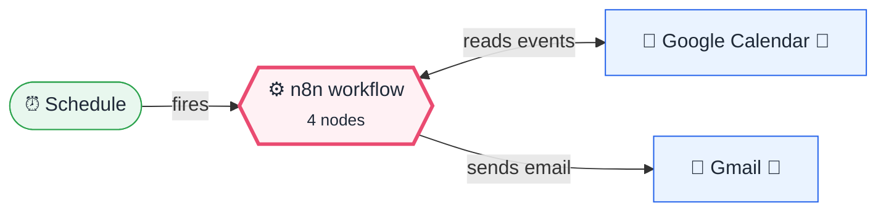
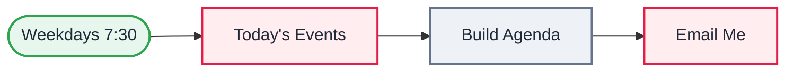

<div align="center">

# Q01 · Daily agenda + free focus slots

    


</div>

> [!NOTE]
> **The real-world problem.** Most people open their calendar and react. A 7:30 AM email showing today's meetings, how heavy the day is, and where the **focus slots** are lets you plan deep work before the first call.

## 💡 Concept first

**📌 Key idea:** Use **Luxon dates** (`$today`, `.plus()`) and simple algorithms to turn raw calendar data into a decision (where's my focus time?).

**🧠 Mental model:** A personal assistant who reads your diary and says "your best hour is 11–12".

**🚫 When *not* to use it:** Don't read the whole calendar. Always pass a time window.

## 🎯 What you'll learn

- Google Calendar *Get many events* with a time window
- `$today` and Luxon date maths (`$today.plus({ days: 1 })`)
- A gap-finding algorithm in the Code node
- `alwaysOutputData` so empty days still send an email

## 🏗️ Architecture

**System context:** who and what this workflow talks to, and what crosses each boundary. 🔑 = needs a credential · 🧑 = a human decides.



<details><summary><b>Node-level flow</b> (every node and branch)</summary>



</details>

<details><summary>Plain-text flow</summary>

```
Schedule (weekdays 7:30) → Google Calendar events today → Code (agenda + free slots) → Gmail
```

</details>

## 🔑 Credentials

| You need | Where to get it |
|---|---|
| Google Calendar OAuth2 (same Google Cloud project as Gmail) | [docs/credentials.md](../../docs/credentials.md) |
| Gmail OAuth2 | [docs/credentials.md](../../docs/credentials.md) |

## 📝 Before you run it

Replace these placeholder values with your own:

| Node | Field | Placeholder |
|---|---|---|
| Email Me | `sendTo` | `you@example.com` |

Nodes that need a credential selected after import: **Gmail**.

## 🛠️ Build it step by step

> [!TIP]
> In a hurry? Import [`workflow.json`](workflow.json) (copy → paste on the n8n canvas). Learning? Build it yourself using the steps below, then compare.

1. Enable the **Google Calendar API** in your Google Cloud project, then create a *Google Calendar OAuth2* credential.
2. Add **Google Calendar → Event → Get many**, calendar `primary`, *Return all*, After `{{ $today }}`, Before `{{ $today.plus({ days: 1 }) }}`. Options: *Single events* on, order by start time.
3. Settings tab → **Always Output Data** on.
4. Paste the Code node. Change `DAY_START`, `DAY_END` and `MIN_FOCUS` to suit your day.
5. Gmail to yourself.

## 🔍 Node-by-node reference

Every node in this workflow and every setting inside it, generated from [`workflow.json`](workflow.json). Click a node to expand it.

<details><summary><b>1. Weekdays 7:30</b> · <code>Schedule Trigger</code> v1.2</summary>

> Starts the workflow on a timer or cron expression. Only fires when the workflow is **active**.

| Property | Value |
|---|---|
| `rule.interval.field` | cronExpression |
| `rule.interval.expression` | 30 7 * * 1-5 |

</details>

<details><summary><b>2. Today's Events</b> · <code>googleCalendar</code> v1.3</summary>


| Property | Value |
|---|---|
| `operation` | getAll |
| `calendar` | primary |
| `returnAll` | ✅ on |
| `timeMin` | `{{ $today }}` |
| `timeMax` | `{{ $today.plus({ days: 1 }) }}` |
| `singleEvents` | ✅ on |
| `orderBy` | startTime |
| `⚙️ Always output data` | ✅ on |

</details>

<details><summary><b>3. Build Agenda</b> · <code>Code</code> v2</summary>

> Runs JavaScript. *Run once for all items* sees every item; *for each item* sees one at a time.

| Property | Value |
|---|---|
| `jsCode` | (JavaScript, 16 lines, shown below) |

**Code:**

```javascript
const DAY_START = 9, DAY_END = 18, MIN_FOCUS = 45; // hours, hours, minutes
const ev = $input.all().map(i => i.json).filter(e => e.start?.dateTime && e.status !== 'cancelled');
const t = d => new Date(d);
const fmt = d => t(d).toLocaleTimeString('en-IN', { hour: '2-digit', minute: '2-digit', hour12: false, timeZone: $now.zoneName });  // workflow timezone
const mins = ev.reduce((s, e) => s + (t(e.end.dateTime) - t(e.start.dateTime)) / 60000, 0);
// find gaps between meetings inside working hours
// $today = midnight in the workflow timezone, so 9:00–18:00 means your local working day.
let cursor = $today.set({ hour: DAY_START }).toJSDate(); const end = $today.set({ hour: DAY_END }).toJSDate();
const free = [];
for (const e of ev) { const s = t(e.start.dateTime); if (s - cursor >= MIN_FOCUS * 60000) free.push([cursor, s]); if (t(e.end.dateTime) > cursor) cursor = t(e.end.dateTime); }
if (end - cursor >= MIN_FOCUS * 60000) free.push([cursor, end]);
const rows = ev.map(e => `<tr><td>${fmt(e.start.dateTime)}–${fmt(e.end.dateTime)}</td><td>${e.summary || '(no title)'}</td><td>${(e.attendees || []).length}</td></tr>`).join('');
const load = mins > 300 ? '🔴 heavy' : mins > 180 ? '🟠 busy' : '🟢 light';
return [{ json: { subject: `📅 ${ev.length} meetings · ${Math.round(mins / 60 * 10) / 10} h · ${load}`,
  html: `<h3>Meetings</h3>${ev.length ? `<table border=1 cellpadding=6 style="border-collapse:collapse"><tr><th>Time</th><th>Meeting</th><th>People</th></tr>${rows}</table>` : '<p>No meetings 🎉</p>'}`
      + `<h3>Focus slots (≥ ${MIN_FOCUS} min)</h3><ul>${free.map(([a, b]) => `<li>${fmt(a)}–${fmt(b)}</li>`).join('') || '<li>None. Consider declining something.</li>'}</ul>` } }];
```

</details>

<details><summary><b>4. Email Me</b> · <code>Gmail</code> v2.1</summary>

> Sends, reads or labels email. `sendAndWait` pauses the workflow for a human reply.

| Property | Value |
|---|---|
| `sendTo` | you@example.com |
| `subject` | `{{ $json.subject }}` |
| `emailType` | html |
| `message` | `{{ $json.html }}` |
| `appendAttribution` | off |

</details>

> [!TIP]
> ⚙️ rows come from each node's **Settings** tab, not its Parameters tab. `{{ … }}` values are **expressions** evaluated at run time. See [workflow anatomy](../../docs/workflow-anatomy.md) for what every property means.

## ✅ Test it

> [!TIP]
> **Automated end-to-end test: passed.** 4/4 nodes executed in real n8n (2 credentialed nodes replaced by realistic mocks), 2 behaviour checks. See [tests/](../../tests/README.md).

- [ ] Run on a day with 2+ meetings and check that the gaps are right.
- [ ] Run on a weekend. You should get "No meetings 🎉".

## 🧯 Troubleshooting

Problems specific to this workflow are below. For general ones (expressions, items, triggers, AI), see [common mistakes](../../docs/common-mistakes.md).

<details><summary><b>Times are off by a few hours</b></summary>

Set *Workflow settings → Timezone* to your city. The code reads it via `$now.zoneName` and `$today`.

</details>

<details><summary><b>Recurring meetings missing</b></summary>

Turn on *Single events* so recurrences are expanded.

</details>

## 🚀 Level up

- Auto-create a "Focus" event in the biggest free slot.
- Add tomorrow's first meeting so you can prepare the night before.

---

<p align="center"> &nbsp;·&nbsp; <a href="../../README.md#-the-learning-path">📚 All lessons</a> &nbsp;·&nbsp; <a href="../Q02-price-drop-tracker/README.md">Q02 · Price drop tracker →</a></p>
