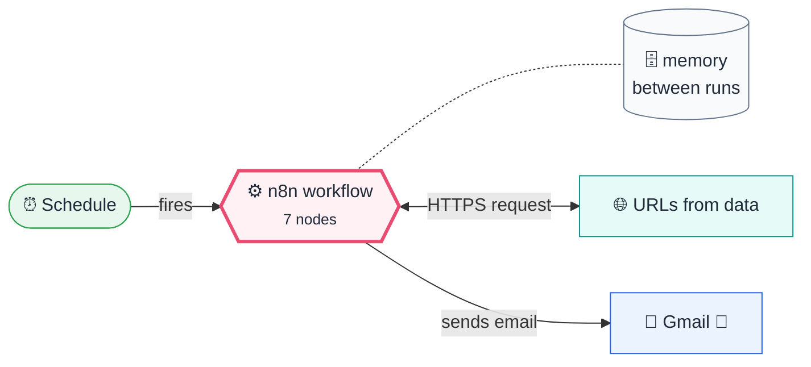
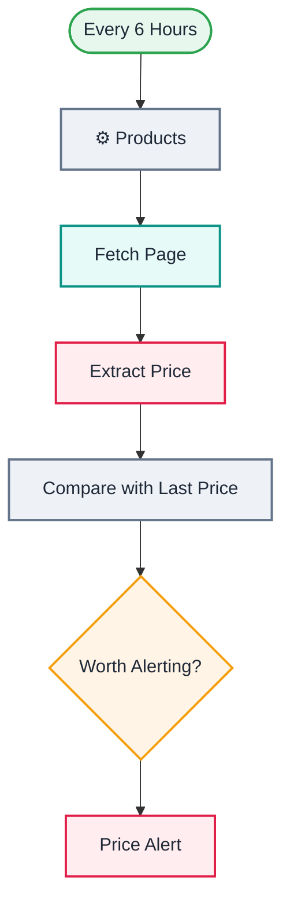

<div align="center">

# Q02 · Price drop tracker

    


</div>

> [!NOTE]
> **The real-world problem.** Waiting for a laptop to go on sale, watching a competitor's pricing, or checking a supplier's rates: all of it is "check a web page, remember a number, tell me when it changes". The same pattern works for stock availability, job postings and government notices.

## 💡 Concept first

**📌 Key idea:** **Scrape → extract → remember → compare**; alert on thresholds and on relative change.

**🧠 Mental model:** A friend who checks the shop window every six hours and texts you only when the price drops.

**🚫 When *not* to use it:** Don't scrape sites that forbid it or render prices with JavaScript. Use their API or a feed.

## 🎯 What you'll learn

- HTTP Request returning raw **HTML text**
- **HTML node**: extract values with CSS selectors
- Parsing prices safely (`replace(/[^0-9.]/g,'')`)
- Remembering values between runs with `$getWorkflowStaticData`
- Two alert rules: absolute target and relative drop

## 🏗️ Architecture

**System context:** who and what this workflow talks to, and what crosses each boundary. 🔑 = needs a credential · 🧑 = a human decides.



<details><summary><b>Node-level flow</b> (every node and branch)</summary>



</details>

<details><summary>Plain-text flow</summary>

```
Schedule (6 h) → Code (product list) → HTTP GET page → HTML extract price → Code (compare with stored price) → Filter → Gmail
```

</details>

## 🔑 Credentials

| You need | Where to get it |
|---|---|
| Gmail OAuth2 (scraping needs no key) | [docs/credentials.md](../../docs/credentials.md) |

## 📝 Before you run it

Replace these placeholder values with your own:

| Node | Field | Placeholder |
|---|---|---|
| Price Alert | `sendTo` | `you@example.com` |

Nodes that need a credential selected after import: **Gmail**.

## 🛠️ Build it step by step

> [!TIP]
> In a hurry? Import [`workflow.json`](workflow.json) (copy → paste on the n8n canvas). Learning? Build it yourself using the steps below, then compare.

1. Add products in *⚙️ Products*. To find a selector, right-click the price in Chrome → *Inspect* → right-click the element → *Copy → Copy selector*.
2. **HTTP Request**: URL `{{ $json.url }}`, Options → Response → *Response format: Text*.
3. **HTML → Extract HTML content** from the `data` field with your selector.
4. Paste the compare Code node, then Filter `alert is true` → Gmail.
5. **Activate** it. Static data only persists in active runs.

## 🔍 Node-by-node reference

Every node in this workflow and every setting inside it, generated from [`workflow.json`](workflow.json). Click a node to expand it.

<details><summary><b>1. Every 6 Hours</b> · <code>Schedule Trigger</code> v1.2</summary>

> Starts the workflow on a timer or cron expression. Only fires when the workflow is **active**.

| Property | Value |
|---|---|
| `rule.interval.field` | hours |
| `rule.interval.hoursInterval` | 6 |

</details>

<details><summary><b>2. ⚙️ Products</b> · <code>Code</code> v2</summary>

> Runs JavaScript. *Run once for all items* sees every item; *for each item* sees one at a time.

| Property | Value |
|---|---|
| `jsCode` | (JavaScript, 5 lines, shown below) |

**Code:**

```javascript
// Add as many products as you like. selector = CSS selector of the price element.
return [
  { name: 'A Light in the Attic', url: 'https://books.toscrape.com/catalogue/a-light-in-the-attic_1000/index.html', selector: 'p.price_color', target: 45 },
  { name: 'Tipping the Velvet', url: 'https://books.toscrape.com/catalogue/tipping-the-velvet_999/index.html', selector: 'p.price_color', target: 50 },
].map(p => ({ json: p }));
```

</details>

<details><summary><b>3. Fetch Page</b> · <code>HTTP Request</code> v4.2</summary>

> Calls any REST API. Use it whenever there's no dedicated node.

| Property | Value |
|---|---|
| `url` | `{{ $json.url }}` |
| `response.response.responseFormat` | text |
| `timeout` | 15000 |
| `⚙️ Retry on fail` | ✅ on |
| `⚙️ On error` | Continue (regular output) |

</details>

<details><summary><b>4. Extract Price</b> · <code>html</code> v1.2</summary>


| Property | Value |
|---|---|
| `operation` | extractHtmlContent |
| `dataPropertyName` | data |
| `extractionValues.key` | price_text |
| `extractionValues.cssSelector` | `{{ $('⚙️ Products').item.json.selector }}` |
| `extractionValues.returnValue` | text |

</details>

<details><summary><b>5. Compare with Last Price</b> · <code>Code</code> v2</summary>

> Runs JavaScript. *Run once for all items* sees every item; *for each item* sees one at a time.

| Property | Value |
|---|---|
| `jsCode` | (JavaScript, 11 lines, shown below) |

**Code:**

```javascript
const state = $getWorkflowStaticData('global'); state.prices ??= {};
const products = $('⚙️ Products').all().map(i => i.json);
return $input.all().map((it, i) => {
  const p = products[i];
  const price = parseFloat(String(it.json.price_text || '').replace(/[^0-9.]/g, ''));
  const last = state.prices[p.url];
  const dropPct = last ? Math.round((last - price) / last * 1000) / 10 : 0;
  const alert = Number.isFinite(price) && (price <= p.target || dropPct >= 5);
  if (Number.isFinite(price)) state.prices[p.url] = price;
  return { json: { ...p, price, last: last ?? null, dropPct, alert, ok: Number.isFinite(price) } };
});
```

</details>

<details><summary><b>6. Worth Alerting?</b> · <code>Filter</code> v2.2</summary>

> Keeps only items that match; drops the rest.

| Property | Value |
|---|---|
| `condition` | `{{ $json.alert }} is true` |

</details>

<details><summary><b>7. Price Alert</b> · <code>Gmail</code> v2.1</summary>

> Sends, reads or labels email. `sendAndWait` pauses the workflow for a human reply.

| Property | Value |
|---|---|
| `sendTo` | you@example.com |
| `subject` | `🏷️ {{ $json.name }} now {{ $json.price }} ({{ $json.dropPct }}% drop)` |
| `emailType` | html |
| `message` | `<p><b>{{ $json.name }}</b> is now <b>{{ $json.price }}</b> (was {{ $json.last ?? 'unknown' }}, target {{ $json.target }}).</p><p><a href="{{ $json.url }}">Open product</a></p>` |
| `appendAttribution` | off |

</details>

> [!TIP]
> ⚙️ rows come from each node's **Settings** tab, not its Parameters tab. `{{ … }}` values are **expressions** evaluated at run time. See [workflow anatomy](../../docs/workflow-anatomy.md) for what every property means.

## ✅ Test it

> [!TIP]
> **Automated end-to-end test: passed.** 6/7 nodes executed in real n8n (1 credentialed nodes replaced by realistic mocks), 0 behaviour checks. See [tests/](../../tests/README.md).

- [ ] Set `target` above the current price, then run it. You should get an alert.
- [ ] Check that a broken URL doesn't stop the other products (*On Error → Continue*).

## 🧯 Troubleshooting

Problems specific to this workflow are below. For general ones (expressions, items, triggers, AI), see [common mistakes](../../docs/common-mistakes.md).

<details><summary><b>Price is NaN</b></summary>

The selector matched nothing. Check it in the browser dev tools; many shops render prices with JavaScript (use their API or a headless-browser service instead).

</details>

<details><summary><b>Blocked / 403</b></summary>

Some sites block bots. Respect robots.txt and terms of service, and prefer official APIs or affiliate feeds.

</details>

## 🏋️ Practice

Try each challenge **before** opening the hint. Solutions show the exact expressions and code.

**⭐ Challenge 1:** Track a product from a site you use (find the CSS selector yourself).

<details><summary>💡 Hint</summary>

Chrome → right-click the price → Inspect → right-click → Copy selector.

</details>
<details><summary>✅ Solution</summary>

Add `{ name, url, selector, target }` to ⚙️ Products. If `price` comes back `NaN`, the price is rendered by JavaScript. Look for a JSON API in the Network tab instead.

</details>

**⭐⭐ Challenge 2:** Log every check to a sheet and include a **30-day low** in the alert.

<details><summary>💡 Hint</summary>

Append each result to Sheets; read the history when alerting.

</details>
<details><summary>✅ Solution</summary>

After *Compare with Last Price*, append `{time, name, price}` to `PriceHistory`. Before the alert, read the history, filter the last 30 days for that product, and compute `Math.min(...)`. Put it in the email: *"lowest in 30 days: …"*

</details>

## 🚀 Ideas to extend it

- Log every price to Sheets and chart the history (see Q05).
- Send to Telegram instead of email (see Q03).

---

<p align="center"><a href="../Q01-daily-agenda-calendar/README.md">← Q01 · Daily agenda + free slots from Google Calendar</a> &nbsp;·&nbsp; <a href="../../README.md#-the-learning-path">📚 All lessons</a> &nbsp;·&nbsp; <a href="../Q03-telegram-capture-bot/README.md">Q03 · Telegram quick-capture bot →</a></p>
