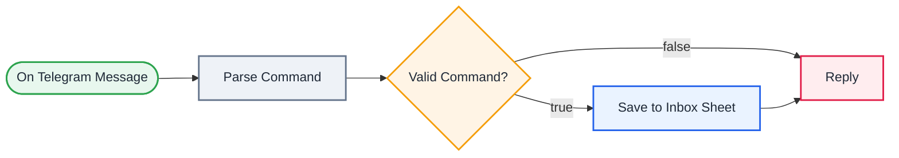

<div align="center">

# Q03 · Telegram quick-capture bot

   


</div>

> [!NOTE]
> **The real-world problem.** Ideas, todos and expenses happen on the move. Opening a spreadsheet on a phone is painful, but a chat message isn't. A bot that files everything into one sheet is the cheapest personal system you can build, and the same pattern works for field staff logging site visits or sales reps logging calls.

## 🎯 What you'll learn

- **Telegram Trigger** (a webhook managed for you)
- Parsing simple commands in Code
- Validating input and replying with help text
- Sending the reply on both branches

## 🏗️ Architecture



<details><summary>Plain-text flow</summary>

```
Telegram message → Code (parse /todo /note /exp) → IF valid
  ├ yes → Sheets append → Telegram reply ✅
  └ no  → Telegram reply (usage help)
```

</details>

## 🔑 Credentials

| You need | Where to get it |
|---|---|
| Telegram bot token | talk to **@BotFather** → `/newbot` |
| Google Sheets OAuth2 (tab `Inbox` | time, chat_id, from, kind, amount, category, text, reply) |

## 📝 Before you run it

Replace these placeholder values with your own:

| Node | Field | Placeholder |
|---|---|---|
| Save to Inbox Sheet | `documentId` | `PASTE_YOUR_GOOGLE_SHEET_URL` |

Nodes that need a credential selected after import: **Google Sheets**.

## 🛠️ Build it step by step

> [!TIP]
> In a hurry? Import [`workflow.json`](workflow.json) (copy → paste on the n8n canvas). Learning? Build it yourself using the steps below, then compare.

1. In Telegram, message **@BotFather**, `/newbot`, and copy the token. Create a *Telegram API* credential in n8n.
2. Add **Telegram Trigger** → updates: *message*.
3. Paste the Parse Command code (*for each item*).
4. IF `kind ≠ error` → Sheets append → Telegram *Send message* to `chat_id`.
5. Wire the IF false branch to the same Reply node.
6. **Activate**. Telegram needs the production webhook, and your n8n must be reachable over HTTPS.

## 🔍 Node-by-node reference

Every node in this workflow and every setting inside it, generated from [`workflow.json`](workflow.json). Click a node to expand it.

<details><summary><b>1. On Telegram Message</b> · <code>telegramTrigger</code> v1.2</summary>


| Property | Value |
|---|---|
| `updates` | message |

</details>

<details><summary><b>2. Parse Command</b> · <code>Code</code> v2</summary>

> Runs JavaScript. *Run once for all items* sees every item; *for each item* sees one at a time.

| Property | Value |
|---|---|
| `mode` | runOnceForEachItem |
| `jsCode` | (JavaScript, 12 lines, shown below) |

**Code:**

```javascript
const text = ($json.message?.text || '').trim();
const [cmd, ...rest] = text.split(/\s+/);
const body = rest.join(' ');
const base = { time: new Date().toISOString(), chat_id: $json.message.chat.id, from: $json.message.from?.first_name || '' };
if (cmd === '/exp') {
  const [amt, category, ...note] = rest;
  const amount = Number(amt);
  if (!Number.isFinite(amount)) return { json: { ...base, kind: 'error', reply: '⚠️ Usage: /exp 450 food lunch' } };
  return { json: { ...base, kind: 'expense', amount, category: category || 'other', text: note.join(' '), reply: `✅ ₹${amount} logged under ${category || 'other'}` } };
}
if (cmd === '/todo' || cmd === '/note') return { json: { ...base, kind: cmd.slice(1), text: body, reply: `✅ ${cmd.slice(1)} saved` } };
return { json: { ...base, kind: 'error', reply: 'Commands: /todo …, /note …, /exp <amount> <category> <note>' } };
```

</details>

<details><summary><b>3. Valid Command?</b> · <code>If</code> v2.2</summary>

> Splits items into a **true** and a **false** branch.

| Property | Value |
|---|---|
| `condition` | `{{ $json.kind }} ≠ error` |

</details>

<details><summary><b>4. Save to Inbox Sheet</b> · <code>Google Sheets</code> v4.5</summary>

> Reads, appends or updates rows in a spreadsheet.

| Property | Value |
|---|---|
| `operation` | append |
| `documentId` | PASTE_YOUR_GOOGLE_SHEET_URL |
| `sheetName` | Inbox |
| `columns.mappingMode` | autoMapInputData |

</details>

<details><summary><b>5. Reply</b> · <code>telegram</code> v1.2</summary>


| Property | Value |
|---|---|
| `chatId` | `{{ $('Parse Command').item.json.chat_id }}` |
| `text` | `{{ $('Parse Command').item.json.reply }}` |
| `additionalFields.appendAttribution` | off |

</details>

> [!TIP]
> ⚙️ rows come from each node's **Settings** tab, not its Parameters tab. `{{ … }}` values are **expressions** evaluated at run time. See [workflow anatomy](../../docs/workflow-anatomy.md) for what every property means.

## ✅ Test it

- [ ] Send `/exp 120 travel auto` and check the new row.
- [ ] Send `hello`. You should get the usage message.

## 🧯 Troubleshooting

Problems specific to this workflow are below. For general ones (expressions, items, triggers, AI), see [common mistakes](../../docs/common-mistakes.md).

<details><summary><b>Bot never replies</b></summary>

The workflow isn't active, or n8n isn't reachable over public HTTPS. Telegram can't call localhost.

</details>

<details><summary><b>Anyone can use my bot</b></summary>

Add an IF on `message.from.id` equal to your own Telegram ID.

</details>

## 🚀 Level up

- Add `/today` that reads today's expenses and replies with a total.
- Accept voice notes and transcribe them with an AI node.

---

<p align="center"><a href="../Q02-price-drop-tracker/README.md">← Q02 · Price drop tracker</a> &nbsp;·&nbsp; <a href="../../README.md#-the-learning-path">📚 All lessons</a> &nbsp;·&nbsp; <a href="../Q04-github-stale-pr-reminder/README.md">Q04 · Stale pull-request reminder →</a></p>
