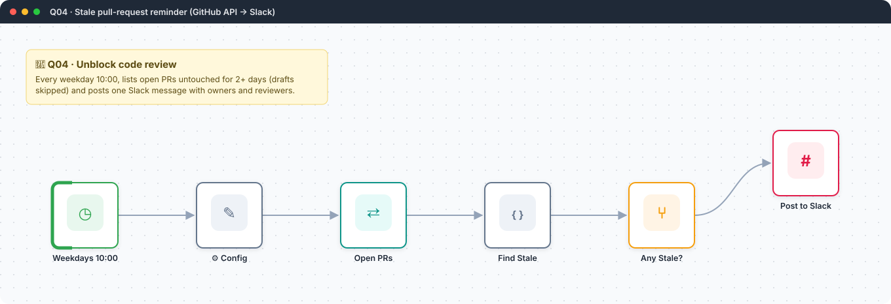
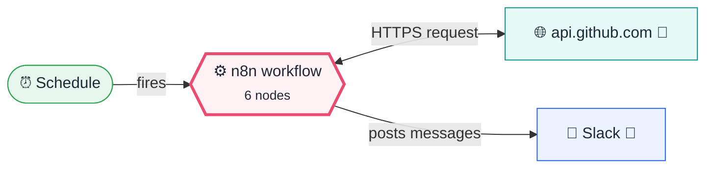
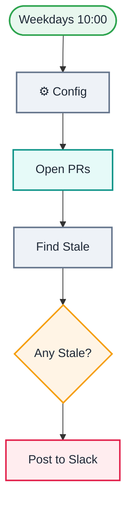

<div align="center">

# Q04 · Stale pull-request reminder

    



</div>

> [!NOTE]
> **The real-world problem.** Code review is the most common hidden bottleneck in software teams. PRs sit for days and nobody notices until the sprint ends. One daily nudge in the team channel with the owner and reviewers named cuts review time dramatically.

## 💡 Concept first

**📌 Key idea:** Surface **stuck work** where the team already is, with names, so it gets unblocked.

**🧠 Mental model:** A polite colleague who walks the floor at 10 AM asking "who's waiting on a review?".

**🚫 When *not* to use it:** Don't nudge on drafts or weekends. Filter the noise, or people mute the channel.

## 🎯 What you'll learn

- GitHub REST API with a **predefined credential**
- Filtering by age and draft status
- Slack message formatting (`<url|text>` links, `*bold*`)
- Only posting when there's something to say

## 🏗️ Architecture

**System context:** who and what this workflow talks to, and what crosses each boundary. 🔑 = needs a credential · 🧑 = a human decides.



<details><summary><b>Node-level flow</b> (every node and branch)</summary>



</details>

<details><summary>Plain-text flow</summary>

```
Schedule → Config → HTTP GET /repos/{repo}/pulls → Code (stale filter) → IF count>0 → Slack
```

</details>

## 🔑 Credentials

| You need | Where to get it |
|---|---|
| GitHub API token (read access to the repo) | [docs/credentials.md](../../docs/credentials.md) |
| Slack app with `chat:write` scope | [docs/credentials.md](../../docs/credentials.md) |

## 📝 Before you run it

No placeholder values. It runs as-is once the credentials are connected.

Nodes that need a credential selected after import: **HTTP Request**.

## 🛠️ Build it step by step

> [!TIP]
> In a hurry? Import [`workflow.json`](workflow.json) (copy → paste on the n8n canvas). Learning? Build it yourself using the steps below, then compare.

1. Create a GitHub credential (classic PAT with `repo`, or a fine-grained token with *Pull requests: read*).
2. Create a Slack app at api.slack.com → OAuth scopes `chat:write` → install → copy the Bot token into a *Slack API* credential. Invite the bot to the channel.
3. Set repo, stale_days and channel in Config.
4. Run it.

## 🔍 Node-by-node reference

Every node in this workflow and every setting inside it, generated from [`workflow.json`](workflow.json). Click a node to expand it.

<details><summary><b>1. Weekdays 10:00</b> · <code>Schedule Trigger</code> v1.2</summary>

> Starts the workflow on a timer or cron expression. Only fires when the workflow is **active**.

| Property | Value |
|---|---|
| `rule.interval.field` | cronExpression |
| `rule.interval.expression` | 0 10 * * 1-5 |

</details>

<details><summary><b>2. ⚙️ Config</b> · <code>Edit Fields (Set)</code> v3.4</summary>

> Creates, renames or overwrites fields without code.

| Property | Value |
|---|---|
| `repo` | n8n-io/n8n |
| `stale_days` | 2 |
| `slack_channel` | #dev |

</details>

<details><summary><b>3. Open PRs</b> · <code>HTTP Request</code> v4.2</summary>

> Calls any REST API. Use it whenever there's no dedicated node.

| Property | Value |
|---|---|
| `url` | `https://api.github.com/repos/{{ $json.repo }}/pulls` |
| `authentication` | predefinedCredentialType |
| `nodeCredentialType` | githubApi |
| `sendQuery` | ✅ on |
| `queryParameters.state` | open |
| `queryParameters.per_page` | 100 |
| `queryParameters.sort` | updated |
| `queryParameters.direction` | asc |
| `⚙️ Retry on fail` | ✅ on |

</details>

<details><summary><b>4. Find Stale</b> · <code>Code</code> v2</summary>

> Runs JavaScript. *Run once for all items* sees every item; *for each item* sees one at a time.

| Property | Value |
|---|---|
| `jsCode` | (JavaScript, 5 lines, shown below) |

**Code:**

```javascript
const cfg = $('⚙️ Config').first().json;
const days = d => Math.floor((Date.now() - Date.parse(d)) / 86400000);
const prs = $input.all().map(i => i.json).filter(p => p.number && !p.draft && days(p.updated_at) >= cfg.stale_days);
const lines = prs.map(p => `• <${p.html_url}|#${p.number} ${p.title}> by *${p.user.login}* · ${days(p.updated_at)}d idle · reviewers: ${(p.requested_reviewers || []).map(r => '@' + r.login).join(', ') || '_none assigned_'}`);
return [{ json: { count: prs.length, text: `:hourglass: *${prs.length} PRs waiting ${cfg.stale_days}+ days in ${cfg.repo}*\n${lines.join('\n')}` } }];
```

</details>

<details><summary><b>5. Any Stale?</b> · <code>If</code> v2.2</summary>

> Splits items into a **true** and a **false** branch.

| Property | Value |
|---|---|
| `condition` | `{{ $json.count }} > 0` |

</details>

<details><summary><b>6. Post to Slack</b> · <code>slack</code> v2.3</summary>


| Property | Value |
|---|---|
| `select` | channel |
| `channelId` | `{{ $('⚙️ Config').item.json.slack_channel }}` |
| `text` | `{{ $json.text }}` |

</details>

> [!TIP]
> ⚙️ rows come from each node's **Settings** tab, not its Parameters tab. `{{ … }}` values are **expressions** evaluated at run time. See [workflow anatomy](../../docs/workflow-anatomy.md) for what every property means.

## ✅ Test it

> [!TIP]
> **Automated end-to-end test: passed.** 6/6 nodes executed in real n8n (2 credentialed nodes replaced by realistic mocks), 1 behaviour checks. See [tests/](../../tests/README.md).

- [ ] Point it at a busy public repo (the default `n8n-io/n8n`) with `stale_days = 1`. You should see a list.

## 🧯 Troubleshooting

Problems specific to this workflow are below. For general ones (expressions, items, triggers, AI), see [common mistakes](../../docs/common-mistakes.md).

<details><summary><b>not_in_channel</b></summary>

Invite the bot: `/invite @your-bot` in the channel.

</details>

<details><summary><b>Only 100 PRs</b></summary>

Add pagination (HTTP node → Options → Pagination) for very large repos.

</details>

## 🚀 Level up

- DM each reviewer instead of posting in the channel.
- Add CI status per PR from the `/commits/{sha}/status` endpoint.

---

<p align="center"><a href="../Q03-telegram-capture-bot/README.md">← Q03 · Telegram quick-capture bot</a> &nbsp;·&nbsp; <a href="../../README.md#-the-learning-path">📚 All lessons</a> &nbsp;·&nbsp; <a href="../Q05-weekly-kpi-chart-email/README.md">Q05 · Weekly KPI chart email →</a></p>
