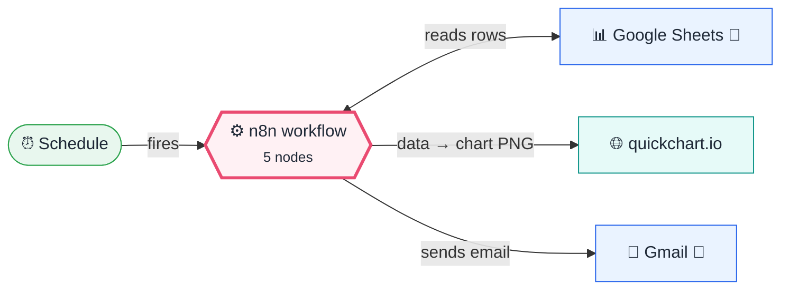
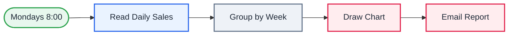

<div align="center">

# Q05 · Weekly KPI chart email

    [](https://github.com/callme-siva/n8n-knowledge/actions/workflows/validate.yml)


</div>

> [!NOTE]
> **The real-world problem.** Small businesses keep numbers in a spreadsheet but never look at the trend. A Monday email with one chart and the week-over-week change is often all the "BI" a team needs.

## 💡 Concept first

**📌 Key idea:** **Aggregate → chart → email**: a picture of the trend beats a table of numbers.

**🧠 Mental model:** A one-slide Monday briefing, printed and on your desk.

**🚫 When *not* to use it:** Don't chart vanity metrics. Pick the one number the team can act on.

## 🎯 What you'll learn

- Google Sheets *read rows*
- Grouping by ISO week in Code
- **QuickChart** node: data to PNG chart as binary
- Attaching binary files to Gmail
- Week-over-week % change

## 🏗️ Architecture

**System context:** who and what this workflow talks to, and what crosses each boundary. 🔑 = needs a credential · 🧑 = a human decides.



<details><summary><b>Node-level flow</b> (every node and branch)</summary>



</details>

## 🔑 Credentials

| You need | Where to get it |
|---|---|
| Google Sheets OAuth2 (tab `Sales` | date, revenue, orders) |
| Gmail OAuth2 | [docs/credentials.md](../../docs/credentials.md) |

## 📝 Before you run it

Replace these placeholder values with your own:

| Node | Field | Placeholder |
|---|---|---|
| Read Daily Sales | `documentId` | `PASTE_YOUR_GOOGLE_SHEET_URL` |
| Email Report | `sendTo` | `you@example.com` |

Nodes that need a credential selected after import: **Gmail**, **Google Sheets**.

### 📥 Starter files

Create each tab from its template, so column names match exactly: **Google Sheets → File → Import → Upload** the CSV → *Insert new sheet(s)*. The tab takes the file's name.

| Tab | Template | Columns |
|---|---|---|
| `Sales` | [Sales.csv](../../templates/Q05-weekly-kpi-chart-email/Sales.csv) | `date`, `orders`, `revenue` |

<sub>Columns are generated from what this workflow actually reads and writes in the automated test, so they can't drift from the workflow.</sub>

## 🛠️ Build it step by step

> [!TIP]
> In a hurry? Import [`workflow.json`](workflow.json) (copy → paste on the n8n canvas). Learning? Build it yourself using the steps below, then compare.

1. Create a `Sales` tab with daily rows (use `=RANDBETWEEN(20000,90000)` to fake 60 days).
2. Sheets → *Get row(s)* from `Sales`.
3. Paste the Group-by-Week code.
4. **QuickChart**: type Bar, labels *from array* `{{ $json.labels }}`, data `{{ $json.revenue }}`, output field `chart`.
5. Gmail → Options → **Attachments** → property `chart`.

## 🔍 Node-by-node reference

Every node in this workflow and every setting inside it, generated from [`workflow.json`](workflow.json). Click a node to expand it.

<details><summary><b>1. Mondays 8:00</b> · <code>Schedule Trigger</code> v1.2</summary>

> Starts the workflow on a timer or cron expression. Only fires when the workflow is **active**.

| Property | Value |
|---|---|
| `rule.interval.field` | cronExpression |
| `rule.interval.expression` | 0 8 * * 1 |

</details>

<details><summary><b>2. Read Daily Sales</b> · <code>Google Sheets</code> v4.5</summary>

> Reads, appends or updates rows in a spreadsheet.

| Property | Value |
|---|---|
| `documentId` | PASTE_YOUR_GOOGLE_SHEET_URL |
| `sheetName` | Sales |
| `⚙️ Retry on fail` | ✅ on |
| `⚙️ Max tries` | 3 |
| `⚙️ Wait between tries (ms)` | 3000 |

</details>

<details><summary><b>3. Group by Week</b> · <code>Code</code> v2</summary>

> Runs JavaScript. *Run once for all items* sees every item; *for each item* sees one at a time.

| Property | Value |
|---|---|
| `jsCode` | (JavaScript, 9 lines, shown below) |

**Code:**

```javascript
// Sheet columns: date (YYYY-MM-DD) | revenue | orders
const weekKey = d => DateTime.fromISO(String(d).slice(0, 10), { zone: 'utc' }).startOf('week').toISODate();  // Monday of that week
const weeks = {};
for (const { json: r } of $input.all()) { if (!r.date) continue; const k = weekKey(r.date); weeks[k] ??= { revenue: 0, orders: 0 }; weeks[k].revenue += Number(r.revenue) || 0; weeks[k].orders += Number(r.orders) || 0; }
const keys = Object.keys(weeks).sort().slice(-8);
const rev = keys.map(k => Math.round(weeks[k].revenue));
const last = rev.at(-1) || 0, prev = rev.at(-2) || 0;
const change = prev ? Math.round((last - prev) / prev * 1000) / 10 : 0;
return [{ json: { labels: keys.map(k => k.slice(5)), revenue: rev, last, prev, change } }];
```

</details>

<details><summary><b>4. Draw Chart</b> · <code>quickChart</code> v1</summary>


| Property | Value |
|---|---|
| `chartType` | bar |
| `labelsMode` | array |
| `labelsArray` | `{{ $json.labels }}` |
| `data` | `{{ $json.revenue }}` |
| `output` | chart |
| `chartOptions.width` | 700 |
| `chartOptions.height` | 320 |
| `chartOptions.backgroundColor` | #ffffff |
| `datasetOptions.label` | Weekly revenue (₹) |
| `datasetOptions.backgroundColor` | #7C3AED |

</details>

<details><summary><b>5. Email Report</b> · <code>Gmail</code> v2.1</summary>

> Sends, reads or labels email. `sendAndWait` pauses the workflow for a human reply.

| Property | Value |
|---|---|
| `sendTo` | you@example.com |
| `subject` | `Weekly revenue ₹{{ $json.last.toLocaleString('en-IN') }} ({{ $json.change >= 0 ? '▲' : '▼' }} {{ $json.change }}%)` |
| `emailType` | html |
| `message` | `<p>Last week: <b>₹{{ $json.last.toLocaleString('en-IN') }}</b>, previous: ₹{{ $json.prev.toLocaleString('en-IN') }} ({{ $json.change }}%).</p><p>Chart attached (last 8 weeks).</p>` |
| `appendAttribution` | off |
| `attachmentsUi.attachmentsBinary.property` | chart |
| `⚙️ Retry on fail` | ✅ on |
| `⚙️ Max tries` | 3 |
| `⚙️ Wait between tries (ms)` | 3000 |

</details>

> [!TIP]
> ⚙️ rows come from each node's **Settings** tab, not its Parameters tab. `{{ … }}` values are **expressions** evaluated at run time. See [workflow anatomy](../../docs/workflow-anatomy.md) for what every property means.

## ✅ Test it

> [!TIP]
> **Automated end-to-end test: passed.** 5/5 nodes executed in real n8n (2 credentialed or AI nodes replaced by fixtures, so AI output itself isn't tested), 1 behaviour checks. See [tests/](../../tests/README.md).

- [ ] Run it and open the PNG in the QuickChart output's Binary tab before emailing.

## 🧯 Troubleshooting

Problems specific to this workflow are below. For general ones (expressions, items, triggers, AI), see [common mistakes](../../docs/common-mistakes.md).

<details><summary><b>Chart is empty</b></summary>

Revenue values were strings with commas. The code uses `Number()`, so strip `₹` and `,` in the sheet.

</details>

<details><summary><b>No attachment</b></summary>

The attachment property name must match the QuickChart *output* field (`chart`).

</details>

## 🏋️ Practice

Try each challenge **before** opening the hint. Solutions show the exact expressions and code.

**⭐ Challenge 1:** Chart **orders** as a second dataset.

<details><summary>💡 Hint</summary>

QuickChart accepts a data array per dataset, or use a line chart for the second series.

</details>
<details><summary>✅ Solution</summary>

Easiest: a second QuickChart node (line) for orders, output `chart2`, and attach both (`chart`, `chart2`). Advanced: call `https://quickchart.io/chart` via HTTP with a full Chart.js config containing two datasets.

</details>

**⭐⭐ Challenge 2:** Highlight the week-over-week change in **red/green** in the email body.

<details><summary>💡 Hint</summary>

Colour based on the sign of `change`.

</details>
<details><summary>✅ Solution</summary>

Message: `<p style="color:{{ $json.change >= 0 ? '#16a34a' : '#dc2626' }}">{{ $json.change >= 0 ? '▲' : '▼' }} {{ $json.change }}%</p>`.

</details>

## 🚀 Ideas to extend it

- Add an AI narrative of the trend (see P12).
- Chart orders and revenue as two datasets.

---

<p align="center"><a href="../Q04-github-stale-pr-reminder/README.md">← Q04 · Stale pull-request reminder</a> &nbsp;·&nbsp; <a href="../../README.md#-the-learning-path">📚 All lessons</a> &nbsp;·&nbsp; <a href="../Q06-invoice-due-reminders/README.md">Q06 · Invoice due & overdue reminders →</a></p>
