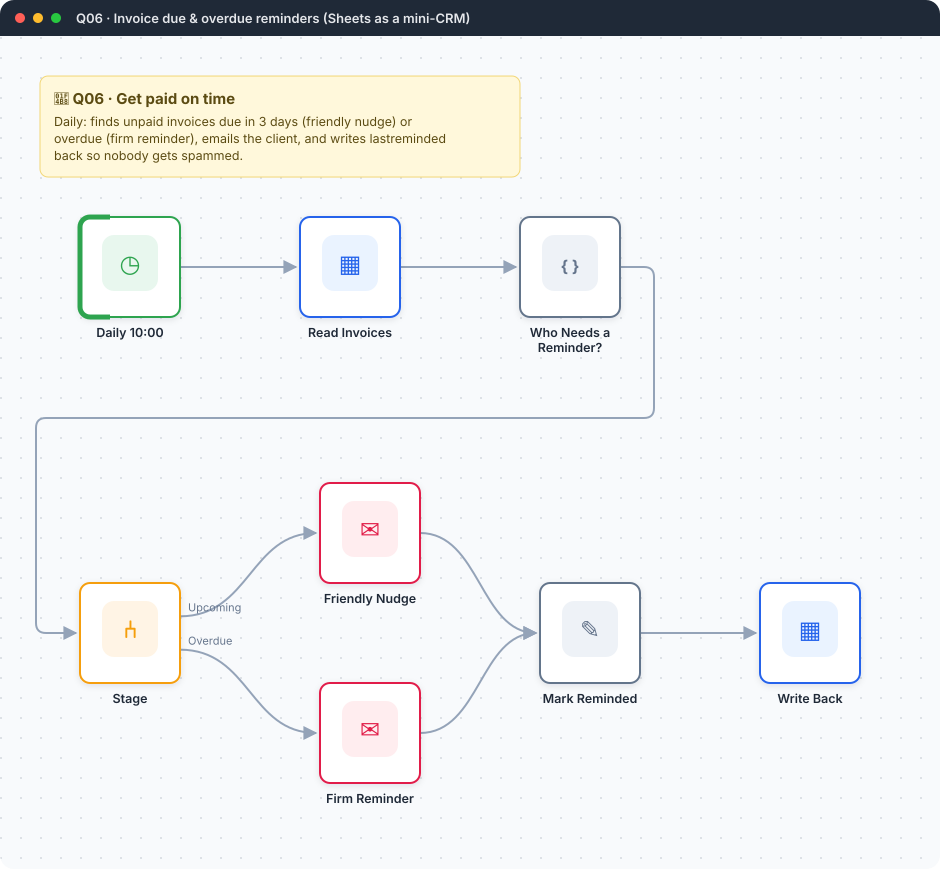
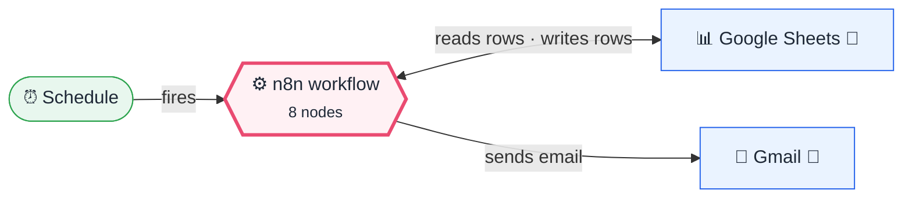
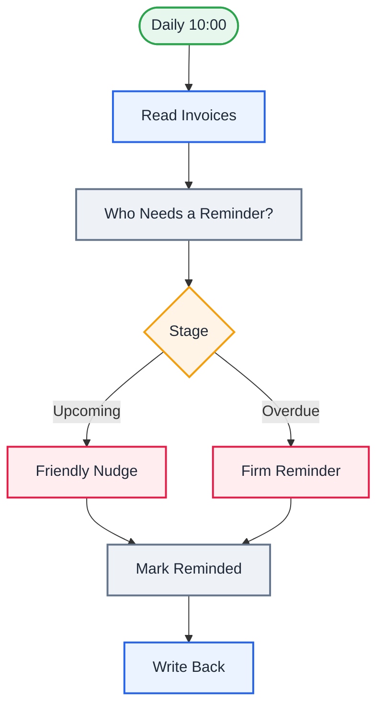

<div align="center">

# Q06 · Invoice due & overdue reminders

    [](https://github.com/callme-siva/n8n-knowledge/actions/workflows/validate.yml)



</div>

> [!NOTE]
> **The real-world problem.** Freelancers and small businesses lose real money to late payments simply because nobody follows up. A polite, consistent, automatic reminder schedule is one of the highest-ROI automations there is.

## 💡 Concept first

**📌 Key idea:** **State in the sheet** (`last_reminded`) makes a scheduled job safe to run again and again.

**🧠 Mental model:** A ledger where you tick "reminded today", so you never call a client twice in one day.

**🚫 When *not* to use it:** Don't compute "today" with `new Date()` (UTC). Use `$today`, which respects the workflow timezone.

## 🎯 What you'll learn

- Date maths for *due in N days* / *N days overdue*
- Switch routing to different email tones
- **Append or update** a row by key (`invoice_no`) to write state back
- Preventing duplicates with a `last_reminded` column

## 🏗️ Architecture

**System context:** who and what this workflow talks to, and what crosses each boundary. 🔑 = needs a credential · 🧑 = a human decides.



<details><summary><b>Node-level flow</b> (every node and branch)</summary>



</details>

## 🔑 Credentials

| You need | Where to get it |
|---|---|
| Google Sheets OAuth2 (tab `Invoices`) | [docs/credentials.md](../../docs/credentials.md) |
| Gmail OAuth2 | [docs/credentials.md](../../docs/credentials.md) |

## 📝 Before you run it

Replace these placeholder values with your own:

| Node | Field | Placeholder |
|---|---|---|
| Read Invoices | `documentId` | `PASTE_YOUR_GOOGLE_SHEET_URL` |
| Write Back | `documentId` | `PASTE_YOUR_GOOGLE_SHEET_URL` |

Nodes that need a credential selected after import: **Gmail**, **Google Sheets**.

### 📥 Starter files

Create each tab from its template, so column names match exactly: **Google Sheets → File → Import → Upload** the CSV → *Insert new sheet(s)*. The tab takes the file's name.

| Tab | Template | Columns |
|---|---|---|
| `Invoices` | [Invoices.csv](../../templates/Q06-invoice-due-reminders/Invoices.csv) | `invoice_no`, `email`, `amount`, `client`, `due_date`, `last_reminded`, `status` |

<sub>Columns are generated from what this workflow actually reads and writes in the automated test, so they can't drift from the workflow.</sub>

## 🛠️ Build it step by step

> [!TIP]
> In a hurry? Import [`workflow.json`](workflow.json) (copy → paste on the n8n canvas). Learning? Build it yourself using the steps below, then compare.

1. Create the `Invoices` tab with the columns in the Code comment.
2. Sheets *Get row(s)* → paste the selector code.
3. Switch on `stage` → two Gmail nodes.
4. Both → **Set** `invoice_no` + `last_reminded` → Sheets **Append or update**, matching column `invoice_no`.

## 🔍 Node-by-node reference

Every node in this workflow and every setting inside it, generated from [`workflow.json`](workflow.json). Click a node to expand it.

<details><summary><b>1. Daily 10:00</b> · <code>Schedule Trigger</code> v1.2</summary>

> Starts the workflow on a timer or cron expression. Only fires when the workflow is **active**.

| Property | Value |
|---|---|
| `rule.interval.triggerAtHour` | 10 |

</details>

<details><summary><b>2. Read Invoices</b> · <code>Google Sheets</code> v4.5</summary>

> Reads, appends or updates rows in a spreadsheet.

| Property | Value |
|---|---|
| `documentId` | PASTE_YOUR_GOOGLE_SHEET_URL |
| `sheetName` | Invoices |
| `⚙️ Retry on fail` | ✅ on |
| `⚙️ Max tries` | 3 |
| `⚙️ Wait between tries (ms)` | 3000 |

</details>

<details><summary><b>3. Who Needs a Reminder?</b> · <code>Code</code> v2</summary>

> Runs JavaScript. *Run once for all items* sees every item; *for each item* sees one at a time.

| Property | Value |
|---|---|
| `jsCode` | (JavaScript, 9 lines, shown below) |

**Code:**

```javascript
// Columns: invoice_no | client | email | amount | due_date (YYYY-MM-DD) | status (paid/unpaid) | last_reminded
// $today follows the workflow timezone. new Date() is UTC-based and is off by a day near midnight.
const today = $today.toISODate();
const daysTo = d => Math.round(DateTime.fromISO(String(d).slice(0, 10), { zone: $today.zoneName }).diff($today, 'days').days);
return $input.all().map(i => i.json)
  .filter(r => String(r.status).toLowerCase() !== 'paid' && r.due_date && r.last_reminded !== today)
  .map(r => ({ ...r, days: daysTo(r.due_date) }))
  .filter(r => r.days === 3 || r.days < 0 && (-r.days) % 7 === 1)   // 3 days before, then weekly once overdue
  .map(r => ({ json: { ...r, stage: r.days >= 0 ? 'upcoming' : 'overdue' } }));
```

</details>

<details><summary><b>4. Stage</b> · <code>Switch</code> v3.2</summary>

> Routes items to one of many named outputs.

| Property | Value |
|---|---|
| `rule 1.condition` | `{{ $json.stage }} = upcoming` |
| `rule 1.renameOutput` | ✅ on |
| `rule 1.outputKey` | Upcoming |
| `rule 2.condition` | `{{ $json.stage }} = overdue` |
| `rule 2.renameOutput` | ✅ on |
| `rule 2.outputKey` | Overdue |

</details>

<details><summary><b>5. Friendly Nudge</b> · <code>Gmail</code> v2.1</summary>

> Sends, reads or labels email. `sendAndWait` pauses the workflow for a human reply.

| Property | Value |
|---|---|
| `sendTo` | `{{ $json.email }}` |
| `subject` | `Invoice {{ $json.invoice_no }} due on {{ $json.due_date }}` |
| `emailType` | html |
| `message` | `<p>Hi {{ $json.client }},</p><p>A quick heads-up that invoice <b>{{ $json.invoice_no }}</b> for ₹{{ $json.amount }} is due on {{ $json.due_date }}.</p><p>Thank you!</p>` |
| `appendAttribution` | off |
| `⚙️ Retry on fail` | ✅ on |
| `⚙️ Max tries` | 3 |
| `⚙️ Wait between tries (ms)` | 3000 |

</details>

<details><summary><b>6. Firm Reminder</b> · <code>Gmail</code> v2.1</summary>

> Sends, reads or labels email. `sendAndWait` pauses the workflow for a human reply.

| Property | Value |
|---|---|
| `sendTo` | `{{ $json.email }}` |
| `subject` | `Overdue: invoice {{ $json.invoice_no }} ({{ -$json.days }} days)` |
| `emailType` | html |
| `message` | `<p>Hi {{ $json.client }},</p><p>Invoice <b>{{ $json.invoice_no }}</b> for ₹{{ $json.amount }} was due on {{ $json.due_date }} and is now {{ -$json.days }} days overdue.</p><p>Please arrange payment or reply if there's an issue.</p>` |
| `appendAttribution` | off |
| `⚙️ Retry on fail` | ✅ on |
| `⚙️ Max tries` | 3 |
| `⚙️ Wait between tries (ms)` | 3000 |

</details>

<details><summary><b>7. Mark Reminded</b> · <code>Edit Fields (Set)</code> v3.4</summary>

> Creates, renames or overwrites fields without code.

| Property | Value |
|---|---|
| `invoice_no` | `{{ $('Who Needs a Reminder?').item.json.invoice_no }}` |
| `last_reminded` | `{{ $today.toISODate() }}` |

</details>

<details><summary><b>8. Write Back</b> · <code>Google Sheets</code> v4.5</summary>

> Reads, appends or updates rows in a spreadsheet.

| Property | Value |
|---|---|
| `operation` | appendOrUpdate |
| `documentId` | PASTE_YOUR_GOOGLE_SHEET_URL |
| `sheetName` | Invoices |
| `columns.mappingMode` | autoMapInputData |
| `columns.matchingColumns` | invoice_no |
| `⚙️ Retry on fail` | ✅ on |
| `⚙️ Max tries` | 3 |
| `⚙️ Wait between tries (ms)` | 3000 |

</details>

> [!TIP]
> ⚙️ rows come from each node's **Settings** tab, not its Parameters tab. `{{ … }}` values are **expressions** evaluated at run time. See [workflow anatomy](../../docs/workflow-anatomy.md) for what every property means.

## ✅ Test it

> [!TIP]
> **Automated end-to-end test: passed.** 8/8 nodes executed in real n8n (4 credentialed or AI nodes replaced by fixtures, so AI output itself isn't tested), 3 behaviour checks. See [tests/](../../tests/README.md).

- [ ] Add a row due in exactly 3 days with your own email, then run it. You should get one email, and `last_reminded` should be filled in.
- [ ] Run again the same day. There should be no second email.

## 🧯 Troubleshooting

Problems specific to this workflow are below. For general ones (expressions, items, triggers, AI), see [common mistakes](../../docs/common-mistakes.md).

<details><summary><b>Every run re-sends</b></summary>

`matchingColumns` must be `invoice_no`, and the header must match exactly.

</details>

<details><summary><b>Wrong day counts</b></summary>

Dates must be plain `YYYY-MM-DD` text. Format the column as *Plain text* in Sheets.

</details>

## 🏋️ Practice

Try each challenge **before** opening the hint. Solutions show the exact expressions and code.

**⭐ Challenge 1:** Add a third tone: a **final notice** at 30+ days overdue, cc'd to your accountant.

<details><summary>💡 Hint</summary>

Extend the stage calculation and the Switch.

</details>
<details><summary>✅ Solution</summary>

In the code: `stage: r.days >= 0 ? 'upcoming' : -r.days >= 30 ? 'final' : 'overdue'`. Add a Switch rule `final` → Gmail with CC (Options → CC).

</details>

**⭐⭐ Challenge 2:** Mark invoices **paid** automatically when the client's payment email arrives.

<details><summary>💡 Hint</summary>

A second workflow: Gmail trigger on payment notifications → find the invoice → update the row.

</details>
<details><summary>✅ Solution</summary>

Gmail Trigger (`from:alerts@yourbank subject:credited`) → Code: regex the invoice number or amount from the email → Sheets **Append or Update** `{invoice_no, status: 'paid'}`. Reminders stop automatically, because paid rows are filtered out.

</details>

## 🚀 Ideas to extend it

- Attach the invoice PDF from Drive.
- Escalate to a phone call task (Jira/Todoist) after 21 days overdue.

---

<p align="center"><a href="../Q05-weekly-kpi-chart-email/README.md">← Q05 · Weekly KPI chart email</a> &nbsp;·&nbsp; <a href="../../README.md#-the-learning-path">📚 All lessons</a> &nbsp;·&nbsp; <a href="../Q07-gmail-ai-auto-labeler/README.md">Q07 · Gmail AI auto-labeler →</a></p>
