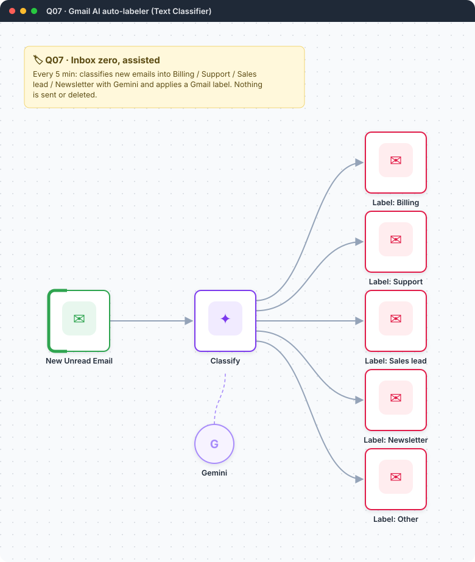
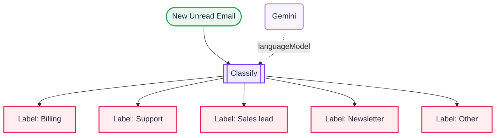

<div align="center">

# Q07 · Gmail AI auto-labeler

   



</div>

> [!NOTE]
> **The real-world problem.** A shared inbox (support@, info@) mixes invoices, customer problems, sales enquiries and noise. Labelling them automatically means each person only looks at their own label, and nothing gets missed or sent by mistake because the AI only *labels*.

## 🎯 What you'll learn

- **Text Classifier** node: one output per category
- Category descriptions are the prompt, so write them carefully
- A *fallback* category for anything uncertain
- A marker label (`ai-labeled`) so each email is processed once

## 🏗️ Architecture



<details><summary>Plain-text flow</summary>

```
Gmail Trigger (unread, not yet labelled) → Text Classifier ⇐ Gemini → 5 outputs → Gmail add labels
```

</details>

## 🔑 Credentials

| You need | Where to get it |
|---|---|
| Gmail OAuth2 | [docs/credentials.md](../../docs/credentials.md) |
| Google Gemini API key | [docs/credentials.md](../../docs/credentials.md) |

## 📝 Before you run it

Replace these placeholder values with your own:

| Node | Field | Placeholder |
|---|---|---|
| Label: Billing | `labelIds` | `REPLACE_LABEL_ID_BILLING, REPLACE_LABEL_ID_AI_LABELED` |
| Label: Support | `labelIds` | `REPLACE_LABEL_ID_SUPPORT, REPLACE_LABEL_ID_AI_LABELED` |
| Label: Sales lead | `labelIds` | `REPLACE_LABEL_ID_SALES, REPLACE_LABEL_ID_AI_LABELED` |
| Label: Newsletter | `labelIds` | `REPLACE_LABEL_ID_NEWSLETTER, REPLACE_LABEL_ID_AI_LABELED` |
| Label: Other | `labelIds` | `REPLACE_LABEL_ID_OTHER, REPLACE_LABEL_ID_AI_LABELED` |

Nodes that need a credential selected after import: **Gmail**, **Gmail Trigger**, **Google Gemini Chat Model**.

## 🛠️ Build it step by step

> [!TIP]
> In a hurry? Import [`workflow.json`](workflow.json) (copy → paste on the n8n canvas). Learning? Build it yourself using the steps below, then compare.

1. In Gmail, create labels: `Billing`, `Support`, `Sales lead`, `Newsletter`, `Other`, `ai-labeled`.
2. Get the label IDs: add a temporary Gmail node *Label → Get many* and run it. Paste the IDs over the `REPLACE_LABEL_ID_…` values.
3. Gmail Trigger: *Simplify* on, unread, search `-label:ai-labeled`.
4. **Text Classifier**: input = from + subject + snippet; add the 4 categories with good descriptions; Options → *When no clear match* → **Other**.
5. Wire each output to a Gmail *Add label* node.

## 🔍 Node-by-node reference

Every node in this workflow and every setting inside it, generated from [`workflow.json`](workflow.json). Click a node to expand it.

<details><summary><b>1. New Unread Email</b> · <code>Gmail Trigger</code> v1.2</summary>

> Polls Gmail on an interval and starts once per matching email.

| Property | Value |
|---|---|
| `pollTimes.item.mode` | everyX |
| `pollTimes.item.value` | 5 |
| `pollTimes.item.unit` | minutes |
| `simple` | ✅ on |
| `filters.readStatus` | unread |
| `filters.q` | -category:promotions -label:ai-labeled |

</details>

<details><summary><b>2. Classify</b> · <code>textClassifier</code> v1.1</summary>


| Property | Value |
|---|---|
| `inputText` | `From: {{ $json.From }} Subject: {{ $json.Subject }}  {{ $json.snippet }}` |
| `categories.categories.1.category` | Billing |
| `categories.categories.1.description` | Invoices, payments, refunds, receipts, subscription charges |
| `categories.categories.2.category` | Support |
| `categories.categories.2.description` | A customer or user reporting a problem or asking how to do something |
| `categories.categories.3.category` | Sales lead |
| `categories.categories.3.description` | Someone interested in buying, requesting a demo, pricing or a quote |
| `categories.categories.4.category` | Newsletter |
| `categories.categories.4.description` | Bulk updates, digests, marketing, notifications from tools |
| `fallback` | other |

</details>

<details><summary><b>3. Gemini</b> · <code>Google Gemini Chat Model</code> v1</summary>

> The language model plugged into a chain or agent.

| Property | Value |
|---|---|
| `modelName` | models/gemini-2.5-flash |
| `temperature` | 0 |

</details>

<details><summary><b>4. Label: Billing</b> · <code>Gmail</code> v2.1</summary>

> Sends, reads or labels email. `sendAndWait` pauses the workflow for a human reply.

| Property | Value |
|---|---|
| `operation` | addLabels |
| `messageId` | `{{ $json.id }}` |
| `labelIds` | REPLACE_LABEL_ID_BILLING, REPLACE_LABEL_ID_AI_LABELED |

</details>

<details><summary><b>5. Label: Support</b> · <code>Gmail</code> v2.1</summary>

> Sends, reads or labels email. `sendAndWait` pauses the workflow for a human reply.

| Property | Value |
|---|---|
| `operation` | addLabels |
| `messageId` | `{{ $json.id }}` |
| `labelIds` | REPLACE_LABEL_ID_SUPPORT, REPLACE_LABEL_ID_AI_LABELED |

</details>

<details><summary><b>6. Label: Sales lead</b> · <code>Gmail</code> v2.1</summary>

> Sends, reads or labels email. `sendAndWait` pauses the workflow for a human reply.

| Property | Value |
|---|---|
| `operation` | addLabels |
| `messageId` | `{{ $json.id }}` |
| `labelIds` | REPLACE_LABEL_ID_SALES, REPLACE_LABEL_ID_AI_LABELED |

</details>

<details><summary><b>7. Label: Newsletter</b> · <code>Gmail</code> v2.1</summary>

> Sends, reads or labels email. `sendAndWait` pauses the workflow for a human reply.

| Property | Value |
|---|---|
| `operation` | addLabels |
| `messageId` | `{{ $json.id }}` |
| `labelIds` | REPLACE_LABEL_ID_NEWSLETTER, REPLACE_LABEL_ID_AI_LABELED |

</details>

<details><summary><b>8. Label: Other</b> · <code>Gmail</code> v2.1</summary>

> Sends, reads or labels email. `sendAndWait` pauses the workflow for a human reply.

| Property | Value |
|---|---|
| `operation` | addLabels |
| `messageId` | `{{ $json.id }}` |
| `labelIds` | REPLACE_LABEL_ID_OTHER, REPLACE_LABEL_ID_AI_LABELED |

</details>

> [!TIP]
> ⚙️ rows come from each node's **Settings** tab, not its Parameters tab. `{{ … }}` values are **expressions** evaluated at run time. See [workflow anatomy](../../docs/workflow-anatomy.md) for what every property means.

## ✅ Test it

- [ ] Send yourself test emails: a fake invoice, a "your app is broken", a "can I get pricing?". Check the labels.

## 🧯 Troubleshooting

Problems specific to this workflow are below. For general ones (expressions, items, triggers, AI), see [common mistakes](../../docs/common-mistakes.md).

<details><summary><b>Everything lands in Other</b></summary>

Descriptions are too vague. Add typical words and examples.

</details>

<details><summary><b>Same email labelled every 5 min</b></summary>

The `ai-labeled` label or the search exclusion is missing.

</details>

## 🚀 Level up

- Route Support to P02 (AI reply drafts).
- Post Sales leads to Slack instantly.

---

<p align="center"><a href="../Q06-invoice-due-reminders/README.md">← Q06 · Invoice due & overdue reminders</a> &nbsp;·&nbsp; <a href="../../README.md#-the-learning-path">📚 All lessons</a> &nbsp;·&nbsp; <a href="../Q08-rss-to-telegram-dedupe/README.md">Q08 · Auto-post new articles to a Telegram channel →</a></p>
