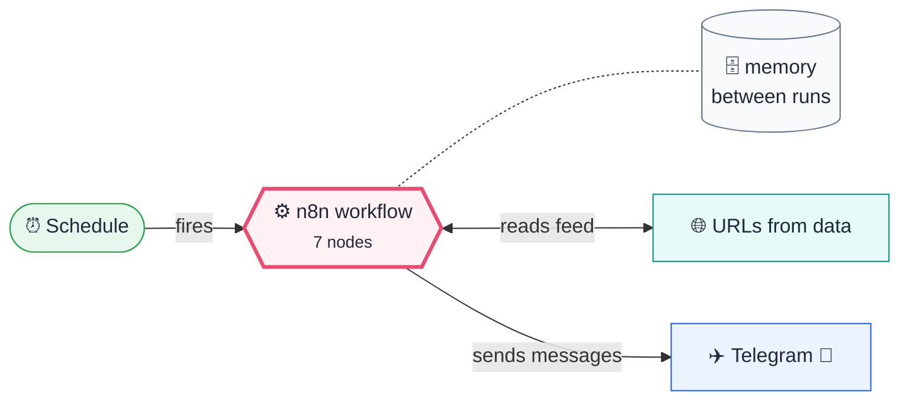
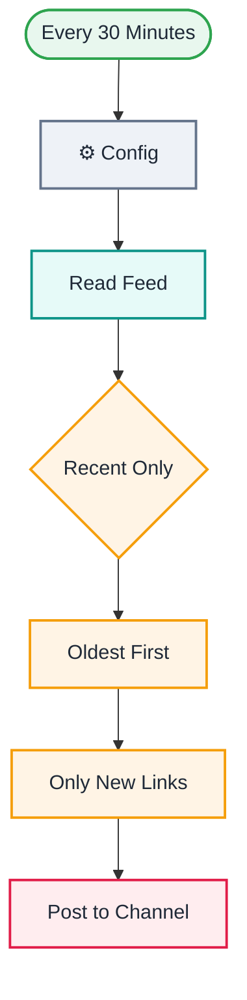

# Q08 · RSS → Telegram channel with dedupe across runs

    

> [!NOTE]
> **The real-world problem.** Communities and company channels need a steady flow of relevant links, and nobody wants to post them by hand. The hard part is never posting the same link twice, even across restarts. n8n's *Remove Duplicates* node now remembers what it has seen between executions.

## 💡 Concept first

**📌 Key idea:** **Deduplicate across executions** so each item is processed once, ever, even after restarts.

**🧠 Mental model:** A bouncer with a guest list who remembers everyone already let in.

**🚫 When *not* to use it:** Don't dedupe on a field that changes (titles get edited). Use a stable ID or URL.

## 🎯 What you'll learn

- **Remove Duplicates → Remove items seen in previous executions**
- History size and what happens when it fills
- Why **filter before dedupe, never limit after it**: anything dropped after dedupe is marked seen and lost
- Sorting so the channel reads in publish order
- Telegram HTML formatting

## 🏗️ Architecture

**System context:** who and what this workflow talks to, and what crosses each boundary. 🔑 = needs a credential · 🧑 = a human decides.

<b>Node-level flow</b> (every node and branch)

## 🔑 Credentials

| You need | Where to get it |
|---|---|
| Telegram bot token (add the bot as an **admin** of your channel) | [docs/credentials.md](../../docs/credentials.md) |

## 📝 Before you run it

No placeholder values. It runs as-is.

## 🛠️ Build it step by step

> [!TIP]
> In a hurry? Import [`workflow.json`](workflow.json) (copy → paste on the n8n canvas). Learning? Build it yourself using the steps below, then compare.

1. Create a channel and add your bot as admin with *Post messages*.
2. Set the feed URL, channel and `max_age_days` in **⚙️ Config**.
3. **Filter** `isoDate` is after `{{ $now.minus({ days: 3 }) }}`, then **Sort** by `isoDate` (ascending). This stops the first run flooding the channel with the whole feed.
4. **Remove Duplicates** → operation *Remove items processed in previous executions*, value `{{ $json.link }}`.
5. Telegram *Send message* to `{{ $('⚙️ Config').first().json.channel }}`, parse mode HTML.

## 🔍 Node-by-node reference

Every node in this workflow and every setting inside it, generated from [`workflow.json`](workflow.json). Click a node to expand it.

<b>1. Every 30 Minutes</b> · <code>Schedule Trigger</code> v1.2

> Starts the workflow on a timer or cron expression. Only fires when the workflow is **active**.

| Property | Value |
|---|---|
| `rule.interval.field` | minutes |
| `rule.interval.minutesInterval` | 30 |

<b>2. ⚙️ Config</b> · <code>Edit Fields (Set)</code> v3.4

> Creates, renames or overwrites fields without code.

| Property | Value |
|---|---|
| `feed_url` | https://blog.n8n.io/rss/ |
| `channel` | @your_channel_name |
| `max_age_days` | 3 |

<b>3. Read Feed</b> · <code>RSS Read</code> v1.1

> Reads an RSS/Atom feed; outputs one item per article.

| Property | Value |
|---|---|
| `url` | `{{ $json.feed_url }}` |
| `⚙️ On error` | Continue (regular output) |

<b>4. Recent Only</b> · <code>Filter</code> v2.2

> Keeps only items that match; drops the rest.

| Property | Value |
|---|---|
| `condition` | `{{ $json.isoDate }} after {{ $now.minus({ days: $('⚙️ Config').first().json.max_age_day…` |

<b>5. Oldest First</b> · <code>sort</code> v1

| Property | Value |
|---|---|
| `sortFieldsUi.sortField.fieldName` | isoDate |

<b>6. Only New Links</b> · <code>removeDuplicates</code> v2

| Property | Value |
|---|---|
| `operation` | removeItemsSeenInPreviousExecutions |
| `dedupeValue` | `{{ $json.link }}` |
| `historySize` | 5000 |

<b>7. Post to Channel</b> · <code>telegram</code> v1.2

| Property | Value |
|---|---|
| `chatId` | `{{ $('⚙️ Config').first().json.channel }}` |
| `text` | `📰 <b>{{ $json.title }}</b> {{ ($json.contentSnippet \|\| '').slice(0, 200) }}… {{ $json.link }}` |
| `additionalFields.parse_mode` | HTML |
| `additionalFields.appendAttribution` | off |
| `⚙️ Retry on fail` | ✅ on |
| `⚙️ Max tries` | 3 |
| `⚙️ Wait between tries (ms)` | 3000 |

> [!TIP]
> ⚙️ rows come from each node's **Settings** tab, not its Parameters tab. `{{ … }}` values are **expressions** evaluated at run time. See [workflow anatomy](../../docs/workflow-anatomy.md) for what every property means.

## ✅ Test it

> [!TIP]
> **Automated end-to-end test: passed.** 7/7 nodes executed in real n8n (2 credentialed or AI nodes replaced by fixtures, so AI output itself isn't tested), 3 behaviour checks. See [tests/](../../tests/README.md).

- [ ] Run twice. The second run should post nothing.
- [ ] The first run posts only articles from the last 3 days, oldest first.
- [ ] **Activate** it. Like static data, dedupe history only builds up in real (active) runs you keep.

## 🧯 Troubleshooting

Problems specific to this workflow are below. For general ones (expressions, items, triggers, AI), see [common mistakes](../../docs/common-mistakes.md).

<b>chat not found</b>

Use `@channelusername` for public channels, or the numeric `-100…` ID for private ones. The bot must be an admin.

<b>Posts everything again after editing</b>

Dedupe history is per node. Deleting or recreating the node resets it.

<b>A post failed and never came back</b>

The link was already marked seen. *Post to Channel* retries 3 times; if Telegram is down longer, repost by hand.

## 🏋️ Practice

Try each challenge **before** opening the hint. Solutions show the exact expressions and code.

**⭐ Challenge 1:** Post only articles matching **keywords** (e.g. "AI", "automation").

💡 Hint

Filter before dedupe, so skipped items aren't remembered.

✅ Solution

Add a **Filter**: `{{ /\b(ai|automation|n8n)\b/i.test($json.title) }}` is true, placed before *Only New Links*.

**⭐⭐ Challenge 2:** Add an AI-written one-line hook per article.

💡 Hint

LLM chain per item, after the Limit (so you pay for max 5).

✅ Solution

After *Max 5 per Run*, add a Basic LLM Chain + Gemini: *"Write one catchy line (max 15 words) about: {{ $json.title }}"*. Use `{{ $json.text }}` in the Telegram message.

## 🚀 Ideas to extend it

- Add AI to write a one-line hook per article.
- Merge several feeds (see L05).

---

<a href="../Q07-gmail-ai-auto-labeler/README.md">← Q07 · Gmail AI auto-labeler</a> &nbsp;·&nbsp; <a href="../../README.md#-the-learning-path">📚 All lessons</a> &nbsp;·&nbsp; 🏁 End of Quick wins

