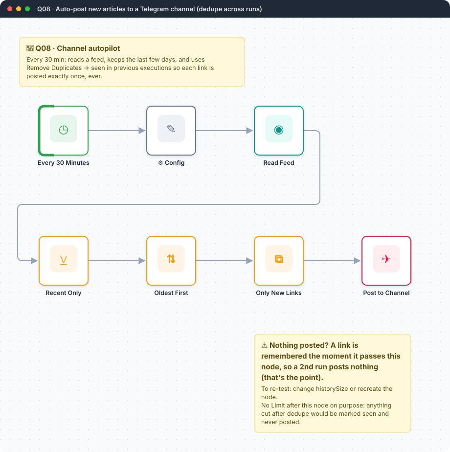

<div align="center">

# Q08 · RSS → Telegram channel with dedupe across runs

   



</div>

> [!NOTE]
> **The real-world problem.** Communities and company channels need a steady flow of relevant links, and nobody wants to post them by hand. The hard part is never posting the same link twice, even across restarts. n8n's *Remove Duplicates* node now remembers what it has seen between executions.

## 🎯 What you'll learn

- **Remove Duplicates → Remove items seen in previous executions**
- History size and what happens when it fills
- **Limit** node to avoid flooding a channel on the first run
- Telegram HTML formatting

## 🏗️ Architecture

```mermaid
flowchart LR
  n0(["Every 30 Minutes"]):::trigger
  n1["Read Feed"]:::http
  n2["Only New Links"]:::msg
  n3["Max 5 per Run"]:::msg
  n4["Post to Channel"]:::msg
  n0 --> n1
  n1 --> n2
  n2 --> n3
  n3 --> n4
  classDef trigger fill:#E8F7EE,stroke:#2EA44F,stroke-width:2px,color:#1F2937
  classDef ai fill:#F1EBFF,stroke:#7C3AED,stroke-width:2px,color:#1F2937
  classDef sub fill:#F7F3FF,stroke:#A78BFA,stroke-width:2px,color:#1F2937
  classDef logic fill:#FFF4E5,stroke:#F59E0B,stroke-width:2px,color:#1F2937
  classDef code fill:#EEF2F7,stroke:#64748B,stroke-width:2px,color:#1F2937
  classDef data fill:#EAF3FF,stroke:#2563EB,stroke-width:2px,color:#1F2937
  classDef http fill:#E6FAF8,stroke:#0D9488,stroke-width:2px,color:#1F2937
  classDef msg fill:#FFEDEF,stroke:#E11D48,stroke-width:2px,color:#1F2937
```



<details><summary>Plain-text flow</summary>

```
Schedule (30 min) → RSS → Remove Duplicates (by link, across runs) → Limit 5 → Telegram channel
```

</details>

## 🔑 Credentials

| You need | Where to get it |
|---|---|
| Telegram bot token (add the bot as an **admin** of your channel) | [docs/credentials.md](../../docs/credentials.md) |

## 📝 Before you run it

No placeholder values. It runs as-is once the credentials are connected.

## 🛠️ Build it step by step

> [!TIP]
> In a hurry? Import [`workflow.json`](workflow.json) (copy → paste on the n8n canvas). Learning? Build it yourself using the steps below, then compare.

1. Create a channel and add your bot as admin with *Post messages*.
2. RSS Read → your feed URL.
3. **Remove Duplicates** → operation *Remove items processed in previous executions*, value `{{ $json.link }}`.
4. **Limit** 5, then Telegram *Send message* to `@your_channel_name`, parse mode HTML.

## 🔍 Node-by-node reference

Every node in this workflow and every setting inside it, generated from [`workflow.json`](workflow.json). Click a node to expand it.

<details><summary><b>1. Every 30 Minutes</b> · <code>Schedule Trigger</code> v1.2</summary>

> Starts the workflow on a timer or cron expression. Only fires when the workflow is **active**.

| Property | Value |
|---|---|
| `rule.interval.field` | minutes |
| `rule.interval.minutesInterval` | 30 |

</details>

<details><summary><b>2. Read Feed</b> · <code>RSS Read</code> v1.1</summary>

> Reads an RSS/Atom feed; outputs one item per article.

| Property | Value |
|---|---|
| `url` | https://blog.n8n.io/rss/ |
| `⚙️ On error` | Continue (regular output) |

</details>

<details><summary><b>3. Only New Links</b> · <code>removeDuplicates</code> v2</summary>


| Property | Value |
|---|---|
| `operation` | removeItemsSeenInPreviousExecutions |
| `dedupeValue` | `{{ $json.link }}` |
| `historySize` | 5000 |

</details>

<details><summary><b>4. Max 5 per Run</b> · <code>limit</code> v1</summary>


| Property | Value |
|---|---|
| `maxItems` | 5 |

</details>

<details><summary><b>5. Post to Channel</b> · <code>telegram</code> v1.2</summary>


| Property | Value |
|---|---|
| `chatId` | @your_channel_name |
| `text` | `📰 <b>{{ $json.title }}</b> {{ ($json.contentSnippet \|\| '').slice(0, 200) }}… {{ $json.link }}` |
| `additionalFields.parse_mode` | HTML |
| `additionalFields.appendAttribution` | off |

</details>

> [!TIP]
> ⚙️ rows come from each node's **Settings** tab, not its Parameters tab. `{{ … }}` values are **expressions** evaluated at run time. See [workflow anatomy](../../docs/workflow-anatomy.md) for what every property means.

## ✅ Test it

- [ ] Run twice. The second run should post nothing.
- [ ] The first run posts only 5 thanks to Limit, and the rest come next time.

## 🧯 Troubleshooting

Problems specific to this workflow are below. For general ones (expressions, items, triggers, AI), see [common mistakes](../../docs/common-mistakes.md).

<details><summary><b>chat not found</b></summary>

Use `@channelusername` for public channels, or the numeric `-100…` ID for private ones. The bot must be an admin.

</details>

<details><summary><b>Posts everything again after editing</b></summary>

Dedupe history is per node. Deleting or recreating the node resets it.

</details>

## 🚀 Level up

- Add AI to write a one-line hook per article.
- Merge several feeds (see L05).

---

<p align="center"><a href="../Q07-gmail-ai-auto-labeler/README.md">← Q07 · Gmail AI auto-labeler</a> &nbsp;·&nbsp; <a href="../../README.md#-the-learning-path">📚 All lessons</a> &nbsp;·&nbsp; 🏁 End of Quick wins</p>
