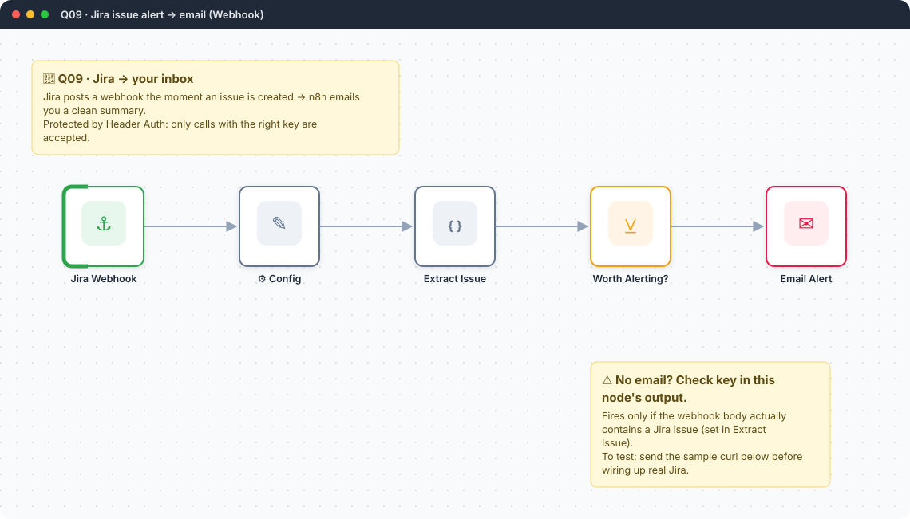
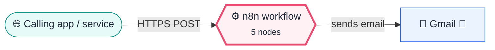
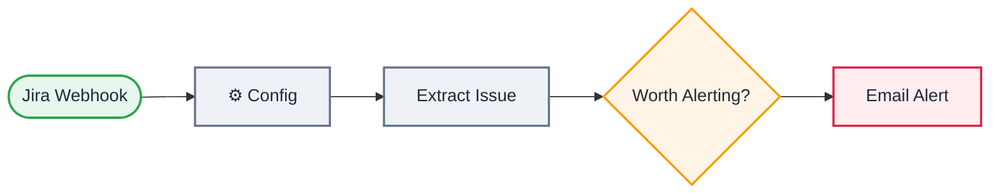

<div align="center">

# Q09 · Jira issue alert → email

    [](https://github.com/callme-siva/n8n-knowledge/actions/workflows/validate.yml)



</div>

> [!NOTE]
> **The real-world problem.** You want to know the moment a critical bug is filed, without watching Jira all day. A webhook pushes the issue to n8n the instant it's created, and you get a readable email instead of a raw JSON payload.

## 💡 Concept first

**📌 Key idea:** A **webhook turns any external event into an n8n trigger**; shape the payload into flat fields before you use them.

**🧠 Mental model:** A doorbell: someone else presses it (Jira), you just react.

**🚫 When *not* to use it:** Never leave a webhook unauthenticated. Anyone who finds the URL can post fake events.

## 🎯 What you'll learn

- **Webhook** node receiving a real third-party webhook (Jira), not a form or schedule
- **Header Auth**: reject unauthenticated calls before your workflow even runs
- Shaping a nested webhook payload (`body.issue.fields...`) into flat, readable fields
- A guard so a malformed or test payload never sends a blank email

## 🏗️ Architecture

**System context:** who and what this workflow talks to, and what crosses each boundary. 🔑 = needs a credential · 🧑 = a human decides.



<details><summary><b>Node-level flow</b> (every node and branch)</summary>



</details>

## 🔑 Credentials

| You need | Where to get it |
|---|---|
| Gmail OAuth2 | [docs/credentials.md](../../docs/credentials.md) |
| Header Auth credential | name it anything, value = a long random string (e.g. `openssl rand -hex 24`) |

## 📝 Before you run it

Replace these placeholder values with your own:

| Node | Field | Placeholder |
|---|---|---|
| ⚙️ Config | `alert_to` | `you@example.com` |

Nodes that need a credential selected after import: **Gmail**.

## 🛠️ Build it step by step

> [!TIP]
> In a hurry? Import [`workflow.json`](workflow.json) (copy → paste on the n8n canvas). Learning? Build it yourself using the steps below, then compare.

1. Add **Webhook**: method POST, path `jira-alert`, Authentication → **Header Auth** → create the credential.
2. Set your real Jira URL and recipient in **⚙️ Config**.
3. Add the **Extract Issue** Code node, then **Filter** `{{ $json.key }}` is not empty.
4. Add **Gmail → Send message** with the subject/body from the sticky note.
5. **Activate** it, then in Jira: *Settings → System → WebHooks → Create a WebHook*, URL = your Production URL, event = *Issue → created*.

## 🔍 Node-by-node reference

Every node in this workflow and every setting inside it, generated from [`workflow.json`](workflow.json). Click a node to expand it.

<details><summary><b>1. Jira Webhook</b> · <code>Webhook</code> v2</summary>

> Gives the workflow its own URL. Any HTTP call to it starts an execution.

| Property | Value |
|---|---|
| `httpMethod` | POST |
| `path` | jira-alert |
| `authentication` | headerAuth |
| `responseMode` | onReceived |

</details>

<details><summary><b>2. ⚙️ Config</b> · <code>Edit Fields (Set)</code> v3.4</summary>

> Creates, renames or overwrites fields without code.

| Property | Value |
|---|---|
| `jira_base_url` | https://your-site.atlassian.net |
| `alert_to` | you@example.com |
| `includeOtherFields` | ✅ on |
| `include` | all |

</details>

<details><summary><b>3. Extract Issue</b> · <code>Code</code> v2</summary>

> Runs JavaScript. *Run once for all items* sees every item; *for each item* sees one at a time.

| Property | Value |
|---|---|
| `jsCode` | (JavaScript, 8 lines, shown below) |

**Code:**

```javascript
const b = $json.body || {};
const issue = b.issue || {};
const f = issue.fields || {};
return [{ json: {
  jira_base_url: $json.jira_base_url, alert_to: $json.alert_to, event: b.webhookEvent || '', key: issue.key || '',
  summary: f.summary || '(no summary)', type: f.issuetype?.name || '', priority: f.priority?.name || 'None', status: f.status?.name || '',
  reporter: f.reporter?.displayName || 'Unknown', assignee: f.assignee?.displayName || 'Unassigned', project: f.project?.name || f.project?.key || '',
} }];
```

</details>

<details><summary><b>4. Worth Alerting?</b> · <code>Filter</code> v2.2</summary>

> Keeps only items that match; drops the rest.

| Property | Value |
|---|---|
| `condition` | `{{ $json.key }} is not empty` |

</details>

<details><summary><b>5. Email Alert</b> · <code>Gmail</code> v2.1</summary>

> Sends, reads or labels email. `sendAndWait` pauses the workflow for a human reply.

| Property | Value |
|---|---|
| `sendTo` | `{{ $json.alert_to }}` |
| `subject` | `🔔 {{ $json.type \|\| 'Issue' }} {{ $json.key }}: {{ $json.summary }}` |
| `emailType` | html |
| `message` | `<p><b>{{ $json.key }}</b> — {{ $json.summary }}</p><p>Type: {{ $json.type }} · Priority: {{ $json.priority }} · Status: {{ $json.status }}</p><p>Reporter: {{ $json.reporter }} · Assignee: {{ $json.assignee }}</p><p><a href="{{ $json.jira_base_url }}/browse/{{ $json.key }}">Open in Jira</a></p>` |
| `appendAttribution` | off |
| `⚙️ Retry on fail` | ✅ on |
| `⚙️ Max tries` | 3 |
| `⚙️ Wait between tries (ms)` | 3000 |

</details>

> [!TIP]
> ⚙️ rows come from each node's **Settings** tab, not its Parameters tab. `{{ … }}` values are **expressions** evaluated at run time. See [workflow anatomy](../../docs/workflow-anatomy.md) for what every property means.

## ✅ Test it

> [!TIP]
> **Automated end-to-end test: passed.** 5/5 nodes executed in real n8n (2 credentialed or AI nodes replaced by fixtures, so AI output itself isn't tested), 3 behaviour checks. See [tests/](../../tests/README.md).

- [ ] `curl -X POST <url> -H 'Authorization: Bearer <key>' -d '{"webhookEvent":"jira:issue_created","issue":{"key":"PROJ-123","fields":{"summary":"Login button does nothing","issuetype":{"name":"Bug"},"priority":{"name":"High"},"status":{"name":"To Do"},"reporter":{"displayName":"Asha Rao"}}}}'` should email you within seconds.
- [ ] The same call with `issue` removed should send **no** email (the Filter blocks it).

## 🧯 Troubleshooting

Problems specific to this workflow are below. For general ones (expressions, items, triggers, AI), see [common mistakes](../../docs/common-mistakes.md).

<details><summary><b>No email, no error</b></summary>

*Worth Alerting?* only passes items with an `issue.key`. Check your test payload matches the real Jira shape.

</details>

<details><summary><b>webhook not registered</b></summary>

The workflow must be **Active**, or use *Listen for test event* + the Test URL while building.

</details>

<details><summary><b>Jira can't reach my n8n</b></summary>

On a laptop, use a tunnel (`cloudflared tunnel --url http://localhost:5678`) and put the tunnel URL in Jira's webhook, per docs/getting-started.md.

</details>

## 🏋️ Practice

Try each challenge **before** opening the hint. Solutions show the exact expressions and code.

**⭐ Challenge 1:** Only alert for **High** or **Highest** priority issues.

<details><summary>💡 Hint</summary>

Add a Filter condition (or extend the existing one).

</details>
<details><summary>✅ Solution</summary>

In **Worth Alerting?**, add an AND condition: `{{ ['High', 'Highest'].includes($json.priority) }}` is true.

</details>

**⭐⭐ Challenge 2:** Route by priority: Slack for everything, email only for High/Highest.

<details><summary>💡 Hint</summary>

A Switch after *Extract Issue*, two branches into Slack and Gmail.

</details>
<details><summary>✅ Solution</summary>

Add a **Switch**: rule 1 `{{ ['High', 'Highest'].includes($json.priority) }}` → output *Urgent* → Gmail; fallback output *Normal* → Slack post with the same fields.

</details>

## 🚀 Ideas to extend it

- Route by `priority`: Slack for Low/Medium, email for High/Highest (Switch after *Extract Issue*).
- Log every alert to a sheet for an audit trail.
- Add *issue: updated* and *issue: deleted* events too.

---

<p align="center"><a href="../Q08-rss-to-telegram-dedupe/README.md">← Q08 · Auto-post new articles to a Telegram channel</a> &nbsp;·&nbsp; <a href="../../README.md#-the-learning-path">📚 All lessons</a> &nbsp;·&nbsp; 🏁 End of Quick wins</p>
