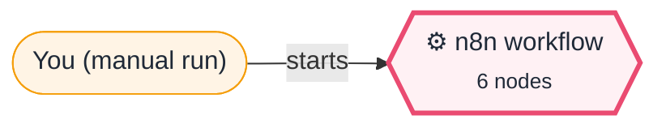
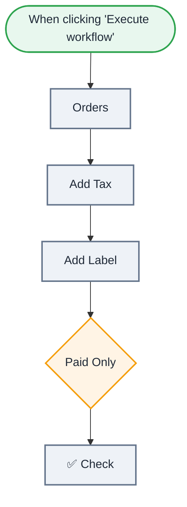

<div align="center">

# X01 · Debug me: the paid-orders report

    [](https://github.com/callme-siva/n8n-knowledge/actions/workflows/validate.yml)


</div>

> [!NOTE]
> **The real-world problem.** Most of the time you spend in n8n isn't building, it's working out why a workflow ran "successfully" and still produced the wrong data. This workflow runs, but it's wrong in 3 ways, each of them a mistake people make every week. Find them using only the INPUT and OUTPUT panels.

## 🎯 What you'll learn

- Reading the **INPUT / OUTPUT** panels to find where data first goes wrong
- Expression typos that silently give `undefined`
- Case-sensitive comparisons in Filter / IF
- `$json` vs the loop variable in *Run once for all items* Code nodes

## 🏗️ Architecture

**System context:** who and what this workflow talks to, and what crosses each boundary. 🔑 = needs a credential · 🧑 = a human decides.



<details><summary><b>Node-level flow</b> (every node and branch)</summary>



</details>

<details><summary>Plain-text flow</summary>

```
Manual → Orders (test data) → Add Tax (Set) → Add Label (Code) → Paid Only (Filter) → ✅ Check (throws until fixed)
```

</details>

## 🔑 Credentials

| You need | Where to get it |
|---|---|
| Nothing | Runs with zero setup |

## 📝 Before you run it

No placeholder values. It runs as-is once the credentials are connected.

## 🛠️ Build it step by step

> [!TIP]
> In a hurry? Import [`workflow.json`](workflow.json) (copy → paste on the n8n canvas). Learning? Build it yourself using the steps below, then compare.

1. Import `workflow.json` (not `solution.json`) and click **Execute workflow**.
2. Open **✅ Check** and read the error. It lists every bug that's still there.
3. Walk the nodes left to right. For each one, compare INPUT with OUTPUT and ask: is this what I expected?
4. Fix one bug and run again. Repeat until ✅ Check says *All fixed*.
5. Stuck? Each bug has a hint and a solution under **Practice** below. The fixed workflow is [`solution.json`](solution.json).

## 🔍 Node-by-node reference

Every node in this workflow and every setting inside it, generated from [`workflow.json`](workflow.json). Click a node to expand it.

<details><summary><b>1. When clicking 'Execute workflow'</b> · <code>Manual Trigger</code> v1</summary>

> Starts the workflow when you click *Execute workflow*. For testing only.

*No settings. This node works with its defaults.*

</details>

<details><summary><b>2. Orders</b> · <code>Code</code> v2</summary>

> Runs JavaScript. *Run once for all items* sees every item; *for each item* sees one at a time.

| Property | Value |
|---|---|
| `jsCode` | (JavaScript, 8 lines, shown below) |

**Code:**

```javascript
// Test data. Don't change this node.
return [
  { order_id: 101, customer: 'Asha', amount: 1000, status: 'Paid' },
  { order_id: 102, customer: 'Ravi', amount: 250, status: 'Unpaid' },
  { order_id: 103, customer: 'Meera', amount: 499.5, status: 'Paid' },
  { order_id: 104, customer: 'Karan', amount: 80, status: 'Unpaid' },
  { order_id: 105, customer: 'Priya', amount: 3200, status: 'Paid' },
].map(o => ({ json: o }));
```

</details>

<details><summary><b>3. Add Tax</b> · <code>Edit Fields (Set)</code> v3.4</summary>

> Creates, renames or overwrites fields without code.

| Property | Value |
|---|---|
| `total` | `{{ Math.round($json.ammount * 118) / 100 }}` |
| `includeOtherFields` | ✅ on |
| `include` | all |
| `ignoreConversionErrors` | ✅ on |

</details>

<details><summary><b>4. Add Label</b> · <code>Code</code> v2</summary>

> Runs JavaScript. *Run once for all items* sees every item; *for each item* sees one at a time.

| Property | Value |
|---|---|
| `jsCode` | (JavaScript, 2 lines, shown below) |

**Code:**

```javascript
// Runs ONCE for all items.
return $input.all().map(i => ({ json: { ...i.json, label: `#${$json.order_id} · ${$json.customer}` } }));
```

</details>

<details><summary><b>5. Paid Only</b> · <code>Filter</code> v2.2</summary>

> Keeps only items that match; drops the rest.

| Property | Value |
|---|---|
| `condition` | `{{ $json.status }} = paid` |
| `⚙️ Always output data` | ✅ on |

</details>

<details><summary><b>6. ✅ Check</b> · <code>Code</code> v2</summary>

> Runs JavaScript. *Run once for all items* sees every item; *for each item* sees one at a time.

| Property | Value |
|---|---|
| `jsCode` | (JavaScript, 11 lines, shown below) |

**Code:**

```javascript
// Don't edit this node: it tells you which bugs are left.
const items = $input.all().map(i => i.json).filter(j => j.order_id);
const bugs = [];
if (items.length !== 3) bugs.push(`Paid Only let ${items.length} order(s) through, expected 3. Compare the status values in Orders with the filter value, letter by letter.`);
const taxed = $('Add Tax').all().map(i => i.json);
if (taxed.some(j => typeof j.total !== 'number' || Number.isNaN(j.total))) bugs.push('Add Tax: total is empty. Open the node and check the field name inside the expression (the INPUT panel shows the real names).');
else if (taxed.some(j => j.total !== Math.round(j.amount * 118) / 100)) bugs.push('Add Tax: total is not amount + 18%.');
const labels = $('Add Label').all().map(i => i.json.label);
if (new Set(labels).size !== labels.length) bugs.push(`Add Label: every order got the label "${labels[0]}". In "run once for all items" mode, $json is only the FIRST item. Use the loop variable.`);
if (bugs.length) throw new Error(`🐞 ${bugs.length} bug(s) left: ` + bugs.map((b, i) => `(${i + 1}) ${b}`).join('  '));
return [{ json: { result: '🎉 All fixed! 3 paid orders, tax added, labels correct.', orders: items } }];
```

</details>

> [!TIP]
> ⚙️ rows come from each node's **Settings** tab, not its Parameters tab. `{{ … }}` values are **expressions** evaluated at run time. See [workflow anatomy](../../docs/workflow-anatomy.md) for what every property means.

## ✅ Test it

> [!TIP]
> **Automated test:** CI runs this broken workflow and checks that ✅ Check reports the bugs, then runs [`solution.json`](solution.json) and checks it passes.

- [ ] ✅ Check outputs `🎉 All fixed!` with 3 orders (101, 103, 105), totals 1180, 589.41 and 3776, and 3 different labels.

## 🧯 Troubleshooting

Problems specific to this workflow are below. For general ones (expressions, items, triggers, AI), see [common mistakes](../../docs/common-mistakes.md).

<details><summary><b>I fixed everything but it still fails</b></summary>

Run the whole workflow again (not just one node), so ✅ Check sees fresh data from every node.

</details>

## 🏋️ Practice

Try each challenge **before** opening the hint. Solutions show the exact expressions and code.

**⭐ Challenge 1:** **Bug 1:** only some orders (or none) get through *Paid Only*.

<details><summary>💡 Hint</summary>

Open *Orders* and *Paid Only* side by side. Compare the status value in the data with the value in the condition, character by character.

</details>
<details><summary>✅ Solution</summary>

The data says `Paid`, the filter compares with `paid`, and Filter is case-sensitive by default. Either type `Paid`, or open the Filter's **Options → Ignore Case**. Ignoring case is safer when data comes from people.

</details>

**⭐ Challenge 2:** **Bug 2:** `total` is empty.

<details><summary>💡 Hint</summary>

Open *Add Tax* and look at the expression preview under the field. Then look at the INPUT panel: which field names actually exist?

</details>
<details><summary>✅ Solution</summary>

The expression says `$json.ammount` (two m's). A missing field is `undefined`, and `undefined * 118` is `NaN`, so n8n leaves it empty without an error. Fix it to `{{ Math.round($json.amount * 118) / 100 }}`. Drag fields from the INPUT panel instead of typing them to avoid this.

</details>

**⭐⭐ Challenge 3:** **Bug 3:** every order has the same label.

<details><summary>💡 Hint</summary>

Check the Code node's mode. In *Run once for all items*, what does `$json` point to?

</details>
<details><summary>✅ Solution</summary>

In *Run once for all items* mode, `$json` is the **first** item only. Inside the `map`, use the loop variable:
```javascript
return $input.all().map(i => ({ json: { ...i.json, label: `#${i.json.order_id} · ${i.json.customer}` } }));
```
Or switch the node to *Run once for each item*, where `$json` is the current item.

</details>

## 🚀 Ideas to extend it

- Break it again in a new way and ask a friend to find it.
- Try X02 next.

---

<p align="center"> &nbsp;·&nbsp; <a href="../../README.md#-the-learning-path">📚 All lessons</a> &nbsp;·&nbsp; <a href="../X02-debug-top-leads/README.md">X02 · Debug me: the top-2 leads list →</a></p>
