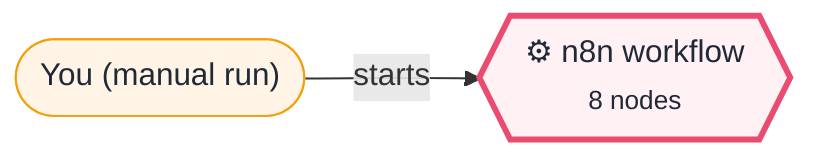
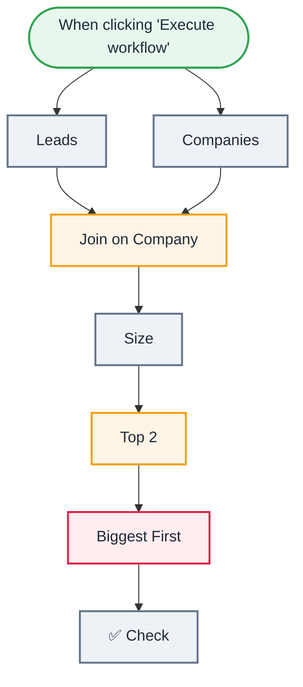

<div align="center">

# X02 · Debug me: the top-2 leads list

    [](https://github.com/callme-siva/n8n-knowledge/actions/workflows/validate.yml)


</div>

> [!NOTE]
> **The real-world problem.** Joining two lists, ranking them and keeping the top few is one of the most common workflow shapes (leads + CRM, orders + customers, tickets + SLAs). It's also where silent bugs hide: a join that matches nothing, numbers that sort as text, and nodes in the wrong order. This workflow has all three.

## 🎯 What you'll learn

- **Merge → Combine by matching fields**, and what happens when keys differ
- Why **types** matter: text sorts differently from numbers
- Node order: Limit before Sort is not the same as Sort before Limit
- Reading a Merge node's two INPUT panels

## 🏗️ Architecture

**System context:** who and what this workflow talks to, and what crosses each boundary. 🔑 = needs a credential · 🧑 = a human decides.



<details><summary><b>Node-level flow</b> (every node and branch)</summary>



</details>

## 🔑 Credentials

| You need | Where to get it |
|---|---|
| Nothing | Runs with zero setup |

## 📝 Before you run it

No placeholder values. It runs as-is once the credentials are connected.

## 🛠️ Build it step by step

> [!TIP]
> In a hurry? Import [`workflow.json`](workflow.json) (copy → paste on the n8n canvas). Learning? Build it yourself using the steps below, then compare.

1. Import `workflow.json` (not `solution.json`) and click **Execute workflow**.
2. Open **✅ Check** and read the error. It changes as you fix bugs, because a later bug can hide behind an earlier one.
3. Open **Join on Company** and look at both INPUT tabs side by side.
4. Fix, re-run, repeat until ✅ Check says *All fixed*.
5. Stuck? Hints and solutions are under **Practice**. The fixed workflow is [`solution.json`](solution.json).

## 🔍 Node-by-node reference

Every node in this workflow and every setting inside it, generated from [`workflow.json`](workflow.json). Click a node to expand it.

<details><summary><b>1. When clicking 'Execute workflow'</b> · <code>Manual Trigger</code> v1</summary>

> Starts the workflow when you click *Execute workflow*. For testing only.

*No settings. This node works with its defaults.*

</details>

<details><summary><b>2. Leads</b> · <code>Code</code> v2</summary>

> Runs JavaScript. *Run once for all items* sees every item; *for each item* sees one at a time.

| Property | Value |
|---|---|
| `jsCode` | (JavaScript, 7 lines, shown below) |

**Code:**

```javascript
// From your form. Don't change this node.
return [
  { name: 'Asha', company: 'Finlytics' },
  { name: 'Ravi', company: 'Kiranmart' },
  { name: 'Meera', company: 'Pixel Studio' },
  { name: 'Karan', company: 'Zenlogix' },
].map(j => ({ json: j }));
```

</details>

<details><summary><b>3. Companies</b> · <code>Code</code> v2</summary>

> Runs JavaScript. *Run once for all items* sees every item; *for each item* sees one at a time.

| Property | Value |
|---|---|
| `jsCode` | (JavaScript, 7 lines, shown below) |

**Code:**

```javascript
// From your CRM export. Don't change this node.
return [
  { Company: 'Finlytics', employees: 120 },
  { Company: 'Kiranmart', employees: 1200 },
  { Company: 'Pixel Studio', employees: 9 },
  { Company: 'Zenlogix', employees: 450 },
].map(j => ({ json: j }));
```

</details>

<details><summary><b>4. Join on Company</b> · <code>Merge</code> v3</summary>

> Waits for several inputs and combines them into one stream.

| Property | Value |
|---|---|
| `mode` | combine |
| `fieldsToMatchString` | company |
| `⚙️ Always output data` | ✅ on |

</details>

<details><summary><b>5. Size</b> · <code>Edit Fields (Set)</code> v3.4</summary>

> Creates, renames or overwrites fields without code.

| Property | Value |
|---|---|
| `size` | `{{ $json.employees }}` |
| `includeOtherFields` | ✅ on |
| `include` | all |

</details>

<details><summary><b>6. Biggest First</b> · <code>sort</code> v1</summary>


| Property | Value |
|---|---|
| `sortFieldsUi.sortField.fieldName` | size |
| `sortFieldsUi.sortField.order` | descending |

</details>

<details><summary><b>7. Top 2</b> · <code>limit</code> v1</summary>


| Property | Value |
|---|---|
| `maxItems` | 2 |

</details>

<details><summary><b>8. ✅ Check</b> · <code>Code</code> v2</summary>

> Runs JavaScript. *Run once for all items* sees every item; *for each item* sees one at a time.

| Property | Value |
|---|---|
| `jsCode` | (JavaScript, 11 lines, shown below) |

**Code:**

```javascript
// Don't edit this node: it tells you which bugs are left.
const items = $input.all().map(i => i.json).filter(j => j.name);
const bugs = [];
if (!items.length) bugs.push('Join on Company matched nothing. Look at the field names in Leads and Companies: are they spelled the same, including capitals?');
else {
  if (items.some(j => typeof j.size !== 'number')) bugs.push('Size: size is text, so "9" sorts above "1200". Check the type of the field in the Set node.');
  const names = items.map(j => j.name).join(', ');
  if (names !== 'Ravi, Karan') bugs.push(`Got [${names}], expected [Ravi, Karan]. If the sorting is right, check the ORDER of the nodes: what does Top 2 receive?`);
}
if (bugs.length) throw new Error(`🐞 ${bugs.length} bug(s) left: ` + bugs.map((b, i) => `(${i + 1}) ${b}`).join('  '));
return [{ json: { result: '🎉 All fixed! Top 2 leads: Ravi (1200), Karan (450).', leads: items } }];
```

</details>

> [!TIP]
> ⚙️ rows come from each node's **Settings** tab, not its Parameters tab. `{{ … }}` values are **expressions** evaluated at run time. See [workflow anatomy](../../docs/workflow-anatomy.md) for what every property means.

## ✅ Test it

> [!TIP]
> **Automated test:** CI runs this broken workflow and checks that ✅ Check reports the bugs, then runs [`solution.json`](solution.json) and checks it passes.

- [ ] ✅ Check outputs `🎉 All fixed!` with Ravi (Kiranmart, 1200) then Karan (Zenlogix, 450).

## 🧯 Troubleshooting

Problems specific to this workflow are below. For general ones (expressions, items, triggers, AI), see [common mistakes](../../docs/common-mistakes.md).

<details><summary><b>To fix the node order I have to delete connections</b></summary>

Drag from the output dot of one node to the input of another. To remove a connection, hover over it and click the 🗑 icon.

</details>

## 🏋️ Practice

Try each challenge **before** opening the hint. Solutions show the exact expressions and code.

**⭐ Challenge 1:** **Bug 1:** *Join on Company* outputs nothing.

<details><summary>💡 Hint</summary>

Open the Merge node's two INPUT tabs. The field you match on must exist, spelled the same, in both.

</details>
<details><summary>✅ Solution</summary>

Leads use `company`, Companies use `Company`. Keys are case-sensitive, so nothing matches. In the Merge node, turn on **Fields to match have different names** and set Input 1 field `company`, Input 2 field `Company`. (Or rename the field with a Set node before the merge.)

</details>

**⭐⭐ Challenge 2:** **Bug 2:** Pixel Studio (9 employees) ranks above Kiranmart (1,200).

<details><summary>💡 Hint</summary>

Look at `size` in the OUTPUT panel of *Size*. Is it shown as a number or as text?

</details>
<details><summary>✅ Solution</summary>

The Set field's type is **String**, so Sort compares text, and `"9"` comes after `"1200"`. Change the field type to **Number**.

</details>

**⭐⭐ Challenge 3:** **Bug 3:** sorting is right, but the top 2 are still wrong.

<details><summary>💡 Hint</summary>

What does *Top 2* receive, and what does *Biggest First* receive? Follow the connections, not the node names.

</details>
<details><summary>✅ Solution</summary>

*Top 2* runs **before** *Biggest First*, so it keeps the first 2 items in the original order and only then sorts them. Rewire it as `Size → Biggest First → Top 2 → ✅ Check`.

</details>

## 🚀 Ideas to extend it

- Change it to top 3 per size band (hint: Switch + Limit per branch).
- Replace Companies with a Google Sheets read (L07).

---

<p align="center"><a href="../X01-debug-order-report/README.md">← X01 · Debug me: the paid-orders report</a> &nbsp;·&nbsp; <a href="../../README.md#-the-learning-path">📚 All lessons</a> &nbsp;·&nbsp; 🏁 End of the debug challenges</p>
